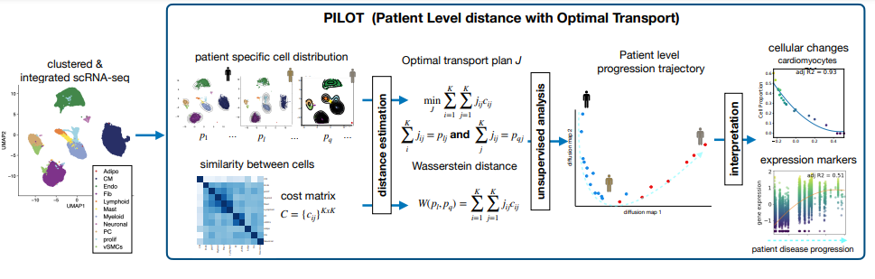

# PILOT

PILOT uses optimal transport to compute the Wasserstein distance between two single single-cell experiments. This allows us to perform unsupervised analysis at the sample level and to uncover trajectories associated with disease progression. Moreover, PILOT provides a statistical approach to delineate non-linear changes in cell populations, gene expression and tissues structures related to the disease trajectories.  We evaluate PILOT and competing approaches in  disease single-cell genomics and pathomics studies with up to 1.000 patients/donors and millions of cells or structures. Results demonstrate that PILOT detects disease-associated samples, cells, and genes from large and complex single-cell and pathomics data.





Current version for PILOT is 2.0.1

## Installation
The easiest way to install PILOT and the required packages is using the following way,

```terminal
git clone https://github.com/CostaLab/PILOT
cd PILOT
conda create --name PILOT r-base
conda activate PILOT
conda install -c conda-forge rpy2
conda install jupyter
pip install .
```
Once you've completed these steps, you can proceed to run the tutorials and explore the features of PILOT. 
When doing so, remember to move to the tutorial folder, as all the work will be performed there:

```terminal
cd Tutorial
```

## [Tutorial](https://pilot.readthedocs.io/en/latest/index.html)
There are three tutorials, one for [Myocardial Infarction (single cell data)](https://pilot.readthedocs.io/en/latest/Myocardial_infarction.html), and the second tutorial for [pathomics data, the combination of Kidney IgAN(G) & Kidney IgAN(T)](https://pilot.readthedocs.io/en/latest/Combination_Kidney_IgAN.html) and the last one is for [Patients sub-group detection and then ranking cells/genes (Pancreas data)](https://pilot.readthedocs.io/en/latest/Patients_sub_group_detection.html)
 


