### Evaluate the presence of sample level batch effects by PILOT (Subgroups of patients)

<div class="alert alert-block alert-info">
In this tutorial, we will demonstrate how to use statistical tests to evaluate the potential association between the detected subgroups of patients with any experimental or clinical variable present in a data set. This example will be based on the kidney single cell data.
</div>


```python
import PILOT as pl
import scanpy as sc
import pandas as pd
```

#### Reading the original Anndata:
First, we consider the original kidney single cell data. You can download the Anndata (h5ad) file from [here](https://costalab.ukaachen.de/open_data/PILOT/Kidney_ori.h5ad), and place it in the _Datasets_ folder.


```python
adata = sc.read_h5ad('/Datasets/Kidney_ori.h5ad')
```

##### Loading the required information and computing the Wasserstein distance:
<div class="alert alert-block alert-info"> In order to work with PILOT, ensure that your Anndata object is loaded and contains the required information.
    
Use the following parameters to configure PILOT for your analysis (Setting Parameters):
    
- adata: Pass your loaded Anndata object to PILOT.
    
- emb_matrix: Provide the name of the variable in the obsm level that holds the dimension reduction (PCA representation).
    
- clusters_col: Specify the name of the column in the observation level of your Anndata that corresponds to cell types or clusters.
    
- sample_col: Indicate the column name in the observation level of your Anndata that contains information about samples or patients.
    
- status: Provide the column name that represents the status or disease (e.g., "control" or "case").
       
</div>


```python
pl.tl.wasserstein_distance(
    adata,
    emb_matrix = 'X_pca',
    clusters_col = 'cell_type',
    sample_col = 'donor_id',
    status = 'disease'
    )
```

##### Patients sub-group detection by clustering the Wasserstein distance. 

<div class="alert alert-block alert-info"> 
The Silhouette Score Curve is used to find the optimal number of clusters by plotting the average Silhouette Score for different numbers of clusters. The number of clusters corresponding to the highest average Silhouette Score is considered the optimal number of clusters. Then, we demonstrate the heatmap of the found clusters.
</div>


```python
pl.pl.select_best_sil(adata, start = 0.2)
```
    
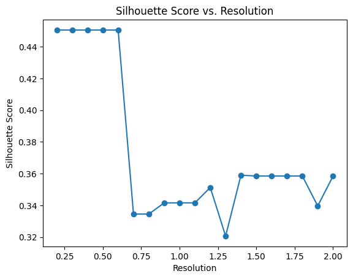
    


    
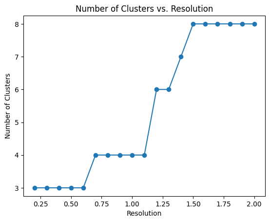
    


```python
proportion_df=pl.pl.clustering_emd(adata, res = adata.uns['best_res'],show_gene_labels=False,sorter_leiden=['1','0','2'],save=True)
```
    
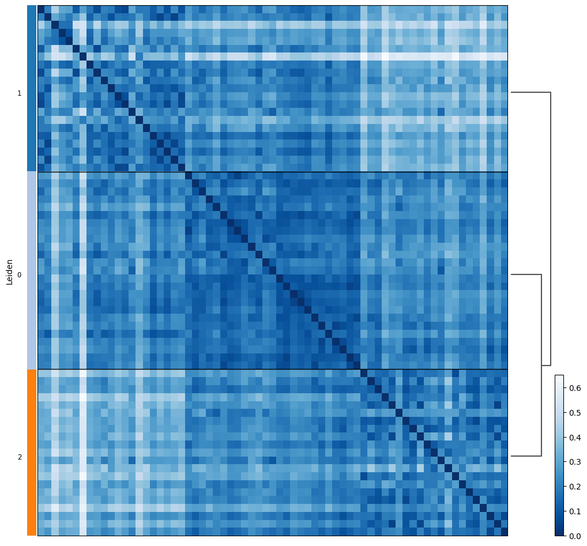
    


##### Evaluation of the association of estimated subgroups with experimental factor:
A very important question is if PILOT analysis is affected by experimental artefacts (location of tissues, batch processing). To evaluate this, we use ANOVA statistics and  Chi-Squared correlation to check any association between any variables describing the found clusters. 
To run these functions, provide the sample_col as the Sample/Patient column and your interested variables. Of note, these functions show just the significant variables (p-value < 0.05).


##### Categorical variables 


```python
categorical = ['BMI','hypertension','development_stage','sex','eGFR','diabetes_history','disease','tissue']
```


```python
pl.tl.correlation_categorical_with_clustering(adata, proportion_df, sample_col = 'donor_id', features = categorical)
```


<div>
<style scoped>
    .dataframe tbody tr th:only-of-type {
        vertical-align: middle;
    }

    .dataframe tbody tr th {
        vertical-align: top;
    }

    .dataframe thead th {
        text-align: right;
    }
</style>
<table border="1" class="dataframe">
  <thead>
    <tr style="text-align: right;">
      <th></th>
      <th>Feature</th>
      <th>ChiSquared_Statistic</th>
      <th>ChiSquared_PValue</th>
    </tr>
  </thead>
  <tbody>
    <tr>
      <th>7</th>
      <td>tissue</td>
      <td>21.906065</td>
      <td>0.001259</td>
    </tr>
    <tr>
      <th>0</th>
      <td>BMI</td>
      <td>18.291352</td>
      <td>0.005544</td>
    </tr>
    <tr>
      <th>6</th>
      <td>disease</td>
      <td>10.600704</td>
      <td>0.031438</td>
    </tr>
  </tbody>
</table>
</div>


##### Numerical variables : Similarly, you can do the same analysis for numerical variables. 


```python
numeric = ['degen.score','aStr.score','aEpi.score','matrisome.score','collagen.score','glycoprotein.score','proteoglycan.score']
```


```python
pl.tl.correlation_numeric_with_clustering(adata, proportion_df, sample_col = 'donor_id', features = numeric)
```


<div>
<style scoped>
    .dataframe tbody tr th:only-of-type {
        vertical-align: middle;
    }

    .dataframe tbody tr th {
        vertical-align: top;
    }

    .dataframe thead th {
        text-align: right;
    }
</style>
<table border="1" class="dataframe">
  <thead>
    <tr style="text-align: right;">
      <th></th>
      <th>Feature</th>
      <th>ANOVA_F_Statistic</th>
      <th>ANOVA_P_Value</th>
    </tr>
  </thead>
  <tbody>
  </tbody>
</table>
</div>


We observe that there is a clear association of the sub-clusters with the origin of the biopsies. This is not surprising as PILOT uses cellular composition information, as samples at distinct regions do have distinct cells.

To double check these results, one can of course plot the heatmap of clusters by showing the variables with 'clinical_variables_corr_sub_clusters' function. 

###### Disease


```python
pl.tl.clinical_variables_corr_sub_clusters(adata,sorter_order=['1','0','2'],sample_col='donor_id',feature='disease',proportion_df=proportion_df)
```


    
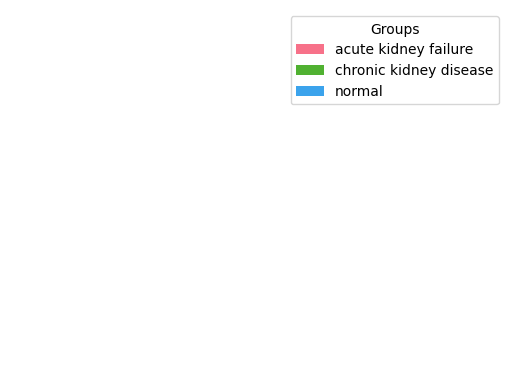
    


    
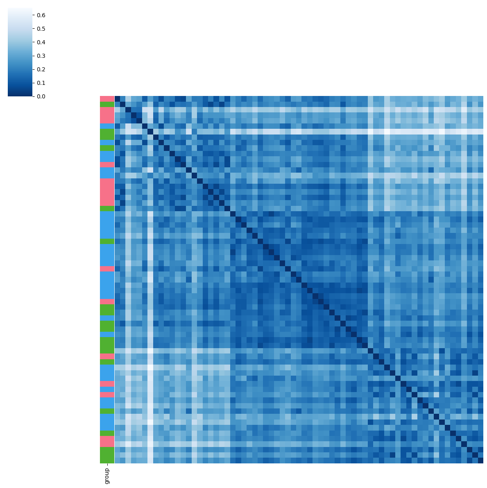
    


###### Tissue


```python
pl.tl.clinical_variables_corr_sub_clusters(adata,sorter_order=['1','0','2'],sample_col='donor_id',feature='tissue',proportion_df=proportion_df)
```


    
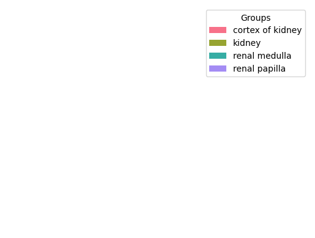
    


    
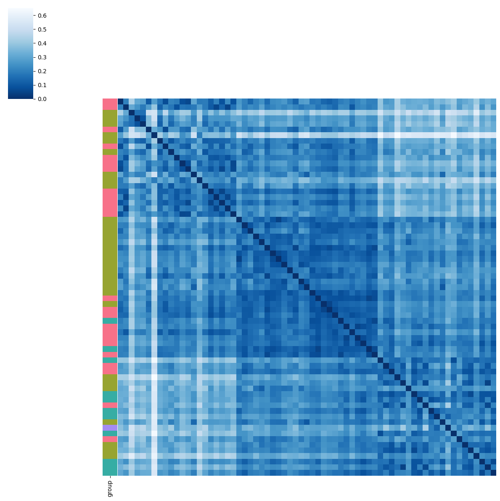
    


###### BMI


```python
pl.tl.clinical_variables_corr_sub_clusters(adata,sorter_order=['1','0','2'],sample_col='donor_id',feature='BMI',proportion_df=proportion_df)
```


    
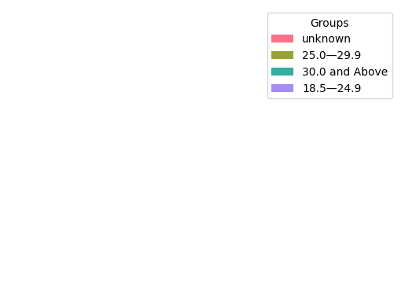
    


    

    


#### Filtering of samples

We focus therefore only on biopsies from sample locationn 'kidney', which were used in our benchmarking. You can download the Anndata (h5ad) file from [here](https://costalab.ukaachen.de/open_data/PILOT/Kidney_filtered.h5ad), and place it in the _Datasets_ folder.


```python
adata_filtered=sc.read_h5ad('/data/scRNA/For_Mina/batch_PILOT/filter_data/Kidney.h5ad')
```


```python
pl.tl.wasserstein_distance(
    adata_filtered,
    emb_matrix = 'X_pca',
    clusters_col = 'cell_type',
    sample_col = 'donor_id',
    status = 'disease'
    )
```

Run the same functions for the filtered data.


```python
pl.pl.select_best_sil(adata_filtered, start = 0.3)
```


    
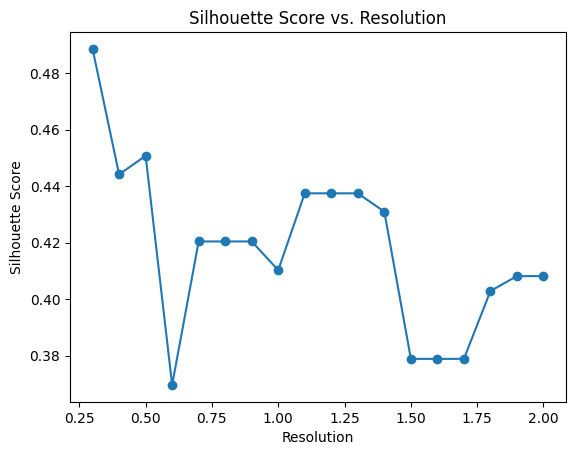
    


    
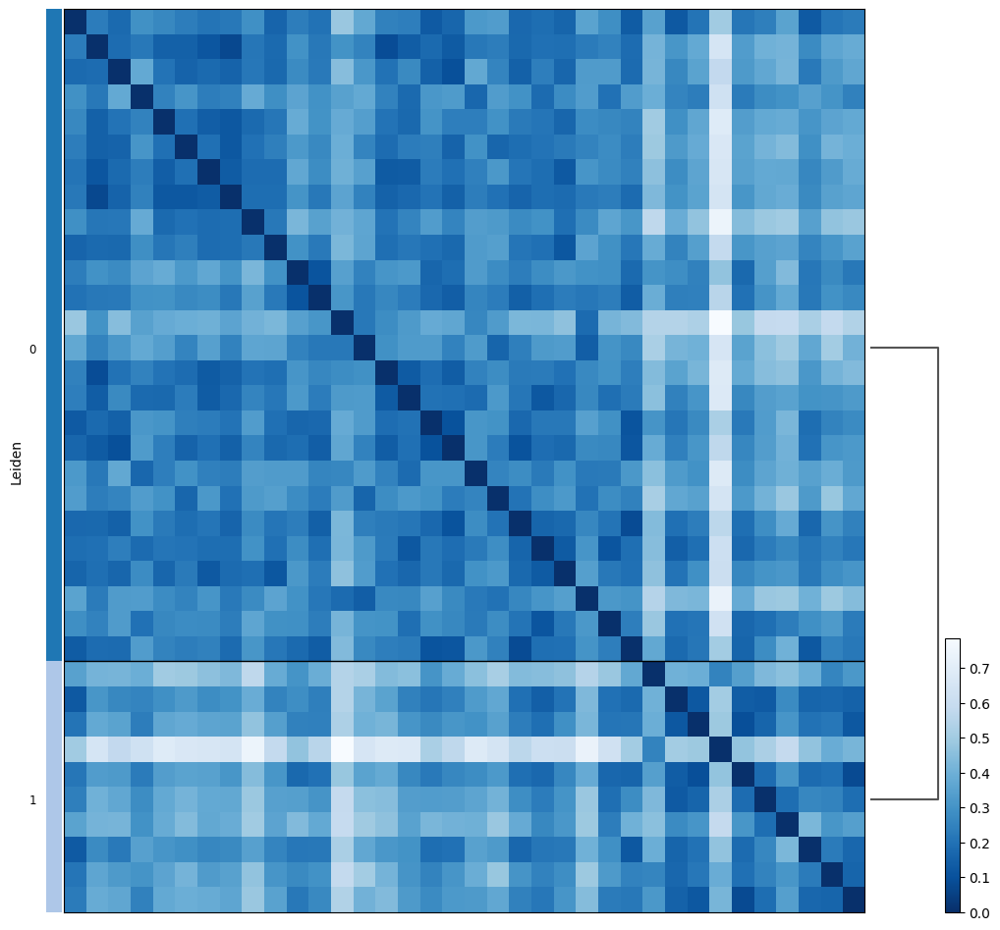
    


```python
proportion_df=pl.pl.clustering_emd(adata_filtered, res = adata_filtered.uns['best_res'],show_gene_labels=False,sorter_leiden=['0','1'],save=True)
```
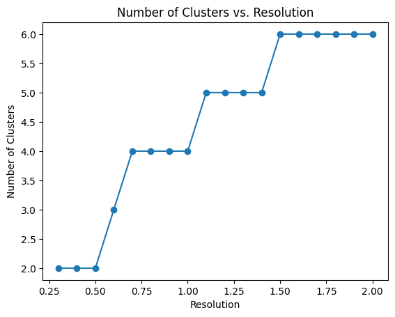
    


We next recheck the association of variables with the estimated sub-clusters. 


```python
pl.tl.correlation_categorical_with_clustering(adata_filtered,proportion_df,sample_col= 'donor_id', features = categorical)
```


<div>
<style scoped>
    .dataframe tbody tr th:only-of-type {
        vertical-align: middle;
    }

    .dataframe tbody tr th {
        vertical-align: top;
    }

    .dataframe thead th {
        text-align: right;
    }
</style>
<table border="1" class="dataframe">
  <thead>
    <tr style="text-align: right;">
      <th></th>
      <th>Feature</th>
      <th>ChiSquared_Statistic</th>
      <th>ChiSquared_PValue</th>
    </tr>
  </thead>
  <tbody>
    <tr>
      <th>6</th>
      <td>disease</td>
      <td>17.488757</td>
      <td>0.000159</td>
    </tr>
    <tr>
      <th>5</th>
      <td>diabetes_history</td>
      <td>6.784615</td>
      <td>0.009195</td>
    </tr>
    <tr>
      <th>0</th>
      <td>BMI</td>
      <td>7.857195</td>
      <td>0.049057</td>
    </tr>
  </tbody>
</table>
</div>


We observed data the true label (disease) has the highest association followed by Diabetes History and BMI.

We can show the distribution of variables in the found clusters:

##### Disease


```python
meta=adata_filtered.obs[['diabetes_history','BMI','donor_id','disease']]
meta = meta.drop_duplicates(subset='donor_id').rename(columns={'donor_id': 'sampleID'})
proportion=proportion_df[['Predicted_Labels','sampleID']].merge(meta,on='sampleID')
contingency_table = pd.crosstab(proportion['disease'], proportion['Predicted_Labels'],values=proportion['sampleID'], aggfunc=pd.Series.nunique, margins=True, margins_name='Total Unique Patients')
# Display the contingency table
contingency_table
```


<div>
<style scoped>
    .dataframe tbody tr th:only-of-type {
        vertical-align: middle;
    }

    .dataframe tbody tr th {
        vertical-align: top;
    }

    .dataframe thead th {
        text-align: right;
    }
</style>
<table border="1" class="dataframe">
  <thead>
    <tr style="text-align: right;">
      <th>Predicted_Labels</th>
      <th>0</th>
      <th>1</th>
      <th>Total Unique Patients</th>
    </tr>
    <tr>
      <th>disease</th>
      <th></th>
      <th></th>
      <th></th>
    </tr>
  </thead>
  <tbody>
    <tr>
      <th>Normal</th>
      <td>17.0</td>
      <td>1.0</td>
      <td>18</td>
    </tr>
    <tr>
      <th>acute kidney failure</th>
      <td>NaN</td>
      <td>5.0</td>
      <td>5</td>
    </tr>
    <tr>
      <th>chronic kidney disease</th>
      <td>9.0</td>
      <td>4.0</td>
      <td>13</td>
    </tr>
    <tr>
      <th>Total Unique Patients</th>
      <td>26.0</td>
      <td>10.0</td>
      <td>36</td>
    </tr>
  </tbody>
</table>
</div>


##### BMI


```python

contingency_table = pd.crosstab(proportion['BMI'], proportion['Predicted_Labels'],values=proportion['sampleID'], aggfunc=pd.Series.nunique, margins=True, margins_name='Total Unique Patients')
contingency_table
```


<div>
<style scoped>
    .dataframe tbody tr th:only-of-type {
        vertical-align: middle;
    }

    .dataframe tbody tr th {
        vertical-align: top;
    }

    .dataframe thead th {
        text-align: right;
    }
</style>
<table border="1" class="dataframe">
  <thead>
    <tr style="text-align: right;">
      <th>Predicted_Labels</th>
      <th>0</th>
      <th>1</th>
      <th>Total Unique Patients</th>
    </tr>
    <tr>
      <th>BMI</th>
      <th></th>
      <th></th>
      <th></th>
    </tr>
  </thead>
  <tbody>
    <tr>
      <th>18.5—24.9</th>
      <td>2.0</td>
      <td>NaN</td>
      <td>2</td>
    </tr>
    <tr>
      <th>25.0—29.9</th>
      <td>10.0</td>
      <td>1.0</td>
      <td>11</td>
    </tr>
    <tr>
      <th>30.0 and Above</th>
      <td>4.0</td>
      <td>NaN</td>
      <td>4</td>
    </tr>
    <tr>
      <th>unknown</th>
      <td>10.0</td>
      <td>9.0</td>
      <td>19</td>
    </tr>
    <tr>
      <th>Total Unique Patients</th>
      <td>26.0</td>
      <td>10.0</td>
      <td>36</td>
    </tr>
  </tbody>
</table>
</div>


##### Diabetes history


```python
contingency_table = pd.crosstab(proportion['diabetes_history'], proportion['Predicted_Labels'],values=proportion['sampleID'], aggfunc=pd.Series.nunique, margins=True, margins_name='Total Unique Patients')
# Display the contingency table
contingency_table
```


<div>
<style scoped>
    .dataframe tbody tr th:only-of-type {
        vertical-align: middle;
    }

    .dataframe tbody tr th {
        vertical-align: top;
    }

    .dataframe thead th {
        text-align: right;
    }
</style>
<table border="1" class="dataframe">
  <thead>
    <tr style="text-align: right;">
      <th>Predicted_Labels</th>
      <th>0</th>
      <th>1</th>
      <th>Total Unique Patients</th>
    </tr>
    <tr>
      <th>diabetes_history</th>
      <th></th>
      <th></th>
      <th></th>
    </tr>
  </thead>
  <tbody>
    <tr>
      <th>No</th>
      <td>17</td>
      <td>1</td>
      <td>18</td>
    </tr>
    <tr>
      <th>Yes</th>
      <td>9</td>
      <td>9</td>
      <td>18</td>
    </tr>
    <tr>
      <th>Total Unique Patients</th>
      <td>26</td>
      <td>10</td>
      <td>36</td>
    </tr>
  </tbody>
</table>
</div>


To double check these results, one can of course plot the heatmap of clusters by showing the variables with 'clinical_variables_corr_sub_clusters' function. 


###### Disease


```python
pl.tl.clinical_variables_corr_sub_clusters(adata_filtered, sorter_order=['0','1'],sample_col='donor_id',feature= 'disease',proportion_df = proportion_df)
```


    

    


    
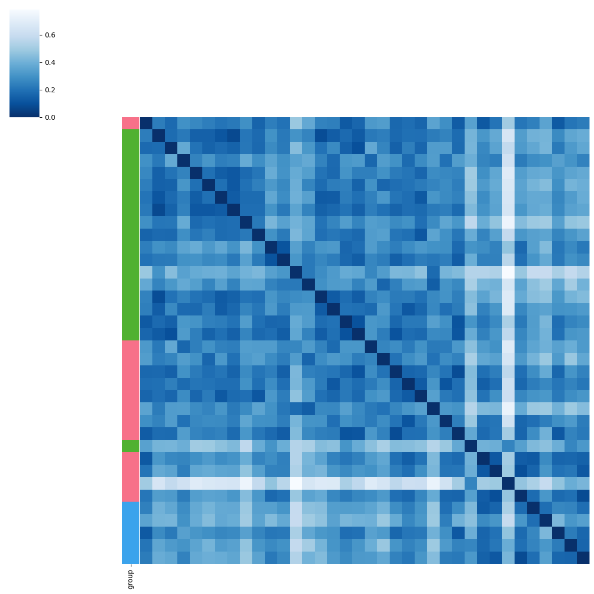
    


###### BMI


```python
pl.tl.clinical_variables_corr_sub_clusters(adata_filtered, sorter_order = ['0','1'],sample_col = 'donor_id',feature = 'BMI',proportion_df = proportion_df)
```


    
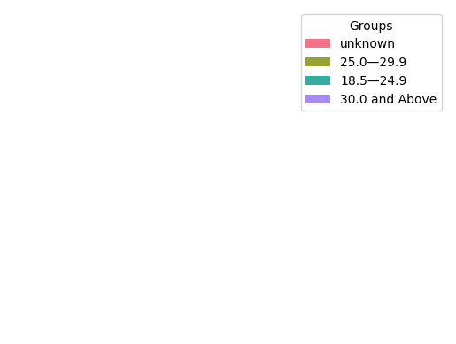
    


    
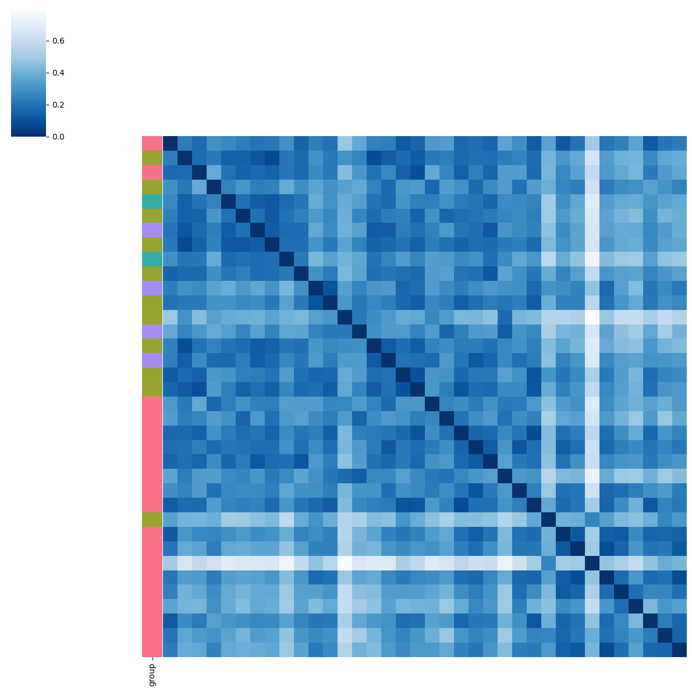
    


###### Diabetes_history


```python
pl.tl.clinical_variables_corr_sub_clusters(adata_filtered, sorter_order = ['0','1'],sample_col = 'donor_id',feature = 'diabetes_history',proportion_df = proportion_df)
```


    

    


    
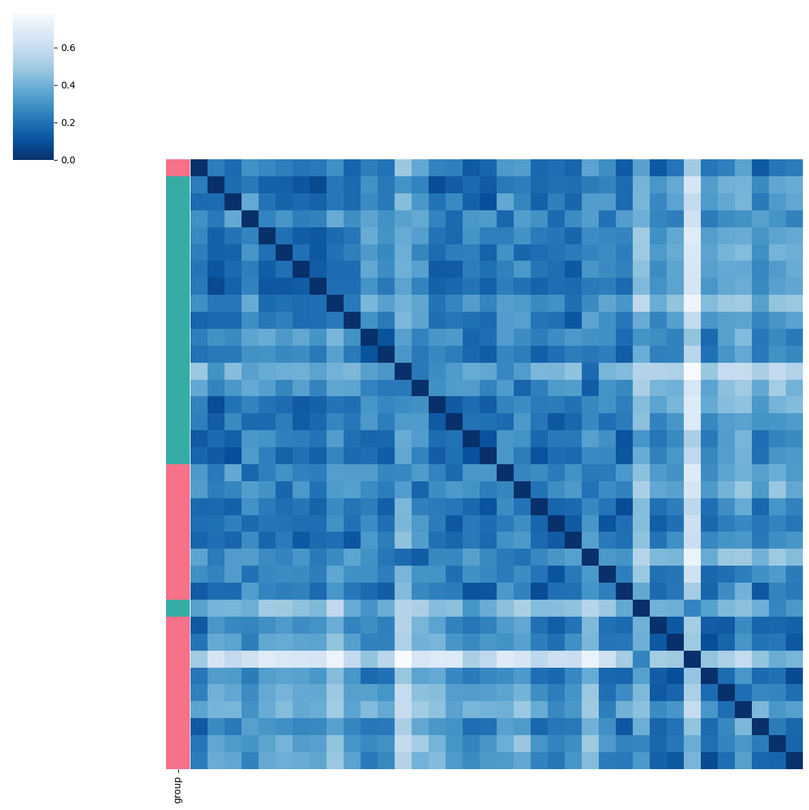
    

