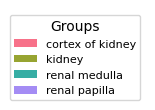

### Evaluate the presence of batch effects by PILOT

<div class="alert alert-block alert-info">
In this tutorial, we include statistical tests to evaluate association between detected clusters with any experimental or clinical variable provided in the Kidney dataset.
</div>


```python
import PILOT as pl
import scanpy as sc
```

##### Reading the original Anndata (without filteration, we consider the Kidney data without any filtering, we observe a high association with the tissue location: renal medulla, cortex of kidney, renal papilla or kidney)


```python
adata = sc.read_h5ad('/data/mu0611151/data/Datasets/Revised_V1_PILOT/Processingdata/adata_scRNA_cxg_pca.h5ad')
```

##### Loading the required information and computing the Wasserstein distance:
<div class="alert alert-block alert-info"> In order to work with PILOT, ensure that your Anndata object is loaded and contains the required information.
    
Use the following parameters to configure PILOT for your analysis (Setting Parameters):
    
- adata: Pass your loaded Anndata object to PILOT.
    
- emb_matrix: Provide the name of the variable in the obsm level that holds the dimension reduction (PCA representation).
    
- clusters_col: Specify the name of the column in the observation level of your Anndata that corresponds to cell types or clusters.
    
- sample_col: Indicate the column name in the observation level of your Anndata that contains information about samples or patients.
    
- status: Provide the column name that represents the status or disease (e.g., "control" or "case").
       
</div>


```python
pl.tl.wasserstein_distance(
    adata,
    emb_matrix = 'X_pca',
    clusters_col = 'cell_type',
    sample_col = 'donor_id',
    status = 'disease'
    )
```

##### In this section, we should find the optimal number of clusters. 
<div class="alert alert-block alert-info"> 
The Silhouette Score Curve is used to find the optimal number of clusters by plotting the average Silhouette Score for different numbers of clusters. The number of clusters corresponding to the highest average Silhouette Score is considered the optimal number of clusters.
</div>


```python
pl.pl.select_best_sil(adata, start = 0.2)
```

    

    


    

    


##### Patients sub-group detection by clustering EMD. 
<div class="alert alert-block alert-info"> 
Using the Silhouette scores of the previous step, we can find the optimal number of cluster of patients to detect different stage of disease. 
</div>


```python
proportion_df=pl.pl.clustering_emd(adata, res = adata.uns['best_res'],show_gene_labels=False,sorter_leiden=['1','0','2'],save=True)
```


    


#### Statistical tests 

For categorical variables, this is based on Chi-Squared statistics on cluster analysis  while for numerical variables this is based on ANOVA for clustering analysis. For these functions, provide the sample_col as the Sample/Patient column and your interested variables. Of note, these functions show just the significant variables (p-values) and ignore the insignificant ones.

##### Categorical variables 


```python
categorical = ['BMI','hypertension','development_stage','sex','eGFR','diabetes_history','disease','tissue']
```


```python
pl.tl.correlation_categorical_with_clustering(adata, proportion_df, sample_col = 'donor_id', features = categorical)
```


<div>
<style scoped>
    .dataframe tbody tr th:only-of-type {
        vertical-align: middle;
    }

    .dataframe tbody tr th {
        vertical-align: top;
    }

    .dataframe thead th {
        text-align: right;
    }
</style>
<table border="1" class="dataframe">
  <thead>
    <tr style="text-align: right;">
      <th></th>
      <th>Feature</th>
      <th>ChiSquared_Statistic</th>
      <th>ChiSquared_PValue</th>
    </tr>
  </thead>
  <tbody>
    <tr>
      <th>7</th>
      <td>disease</td>
      <td>17.488757</td>
      <td>0.000159</td>
    </tr>
    <tr>
      <th>6</th>
      <td>diabetes_history</td>
      <td>6.784615</td>
      <td>0.009195</td>
    </tr>
    <tr>
      <th>1</th>
      <td>BMI</td>
      <td>7.857195</td>
      <td>0.049057</td>
    </tr>
  </tbody>
</table>
</div>


#####  Numerical variables


```python
numeric = ['degen.score','aStr.score','aEpi.score','matrisome.score','collagen.score','glycoprotein.score','proteoglycan.score']
```


```python
pl.tl.correlation_numeric_with_clustering(adata, proportion_df, sample_col = 'donor_id', features = numeric)
```


<div>
<style scoped>
    .dataframe tbody tr th:only-of-type {
        vertical-align: middle;
    }

    .dataframe tbody tr th {
        vertical-align: top;
    }

    .dataframe thead th {
        text-align: right;
    }
</style>
<table border="1" class="dataframe">
  <thead>
    <tr style="text-align: right;">
      <th></th>
      <th>Feature</th>
      <th>ANOVA_F_Statistic</th>
      <th>ANOVA_P_Value</th>
    </tr>
  </thead>
  <tbody>
  </tbody>
</table>
</div>


#### Visualizing Feature Distribution Within Patients sub-group 

Using the 'clinical_variables_corr_sub_clusters' function, you can effectively visualize the distribution of significant variables within the identified subgroups. Please specify 'sample_col' as the Sample/Patient column in your dataset, define the desired 'sorter_order' for the heatmap (in the previous section you can see the order), and select the variables of interest as feature.

##### Disease


```python
pl.tl.clinical_variables_corr_sub_clusters(adata,sorter_order=['1','0','2'],sample_col='donor_id',feature='disease',proportion_df=proportion_df)
```


    

    


    

    


##### Tissue


```python
pl.tl.clinical_variables_corr_sub_clusters(adata,sorter_order=['1','0','2'],sample_col='donor_id',feature='tissue',proportion_df=proportion_df)
```


    

    


    

    


##### BMI


```python
pl.tl.clinical_variables_corr_sub_clusters(adata,sorter_order=['1','0','2'],sample_col='donor_id',feature='BMI',proportion_df=proportion_df)
```


    

    


    

    


### Investigating after filtration

Here, we use the all previous steps for the filtered data set (only samples associated with the kidney (or whole kidney) location).


```python
adata_filtered=sc.read_h5ad('/data/mu0611151/data/Datasets/Revised_V1_PILOT/Zenodo/Kidney.h5ad')
```


```python
pl.tl.wasserstein_distance(
    adata_filtered,
    emb_matrix = 'X_pca',
    clusters_col = 'cell_type',
    sample_col = 'donor_id',
    status = 'disease'
    )
```


```python
pl.pl.select_best_sil(adata_filtered, start = 0.3)
```


    

    


    

    


```python
proportion_df=pl.pl.clustering_emd(adata_filtered, res = adata_filtered.uns['best_res'],show_gene_labels=False,sorter_leiden=['0','1'],save=True)
```

    WARNING: dendrogram data not found (using key=dendrogram_Leiden). Running `sc.tl.dendrogram` with default parameters. For fine tuning it is recommended to run `sc.tl.dendrogram` independently.
    WARNING: saving figure to file figures/heatmap.pdf


    

    


```python
pl.tl.correlation_categorical_with_clustering(adata_filtered,proportion_df,sample_col= 'donor_id', features = categorical)
```


<div>
<style scoped>
    .dataframe tbody tr th:only-of-type {
        vertical-align: middle;
    }

    .dataframe tbody tr th {
        vertical-align: top;
    }

    .dataframe thead th {
        text-align: right;
    }
</style>
<table border="1" class="dataframe">
  <thead>
    <tr style="text-align: right;">
      <th></th>
      <th>Feature</th>
      <th>ChiSquared_Statistic</th>
      <th>ChiSquared_PValue</th>
    </tr>
  </thead>
  <tbody>
    <tr>
      <th>6</th>
      <td>disease</td>
      <td>17.488757</td>
      <td>0.000159</td>
    </tr>
    <tr>
      <th>5</th>
      <td>diabetes_history</td>
      <td>6.784615</td>
      <td>0.009195</td>
    </tr>
    <tr>
      <th>0</th>
      <td>BMI</td>
      <td>7.857195</td>
      <td>0.049057</td>
    </tr>
  </tbody>
</table>
</div>


#### Visualizing Feature Distribution Within Patients sub-group 

##### Disease


```python
pl.tl.clinical_variables_corr_sub_clusters(adata_filtered, sorter_order=['0','1'],sample_col='donor_id',feature= 'disease',proportion_df = proportion_df)
```


    

    


    

    


##### BMI


```python
pl.tl.clinical_variables_corr_sub_clusters(adata_filtered, sorter_order = ['0','1'],sample_col = 'donor_id',feature = 'BMI',proportion_df = proportion_df)
```


    

    


    

    


##### Diabetes_history


```python
pl.tl.clinical_variables_corr_sub_clusters(adata_filtered, sorter_order = ['0','1'],sample_col = 'donor_id',feature = 'diabetes_history',proportion_df = proportion_df)
```


    

    


    

    

