### Evaluate the presence of sample level batch effects by PILOT (Trajectory)

<div class="alert alert-block alert-info">
In this tutorial, we will demonstrate how to use statistical tests to evaluate the potential association between the detected trajectories with any experimental or clinical variable present in a data set. This example will be based on the kidney single cell data.
</div>

```python
import pilotpy as pl
import scanpy as sc
import seaborn as sns
import pandas as pd
```

#### Reading the original Anndata:
First, we consider the original kidney single cell data. You can download the Anndata (h5ad) file from [here](https://costalab.ukaachen.de/open_data/PILOT/Kidney_ori.h5ad), and place it in the _Datasets_ folder.

```python
adata = sc.read_h5ad('Datasets/Kidney_ori.h5ad')
```

##### Loading the required information and computing the Wasserstein distance:
<div class="alert alert-block alert-info"> In order to work with PILOT, ensure that your Anndata object is loaded and contains the required information.
    
Use the following parameters to configure PILOT for your analysis (Setting Parameters):
    
- adata: Pass your loaded Anndata object to PILOT.
    
- emb_matrix: Provide the name of the variable in the obsm level that holds the dimension reduction (PCA representation).
    
- clusters_col: Specify the name of the column in the observation level of your Anndata that corresponds to cell types or clusters.
    
- sample_col: Indicate the column name in the observation level of your Anndata that contains information about samples or patients.
    
- status: Provide the column name that represents the status or disease (e.g., "control" or "case").

Optional settings of the distance (the defaults are the settings of the PILOT paper):

- `cost_method`: how the cost between two cell types is computed: `'centroid'` (default, distance between the centers of the cell types), `'distribution'` (all cells of the cell types), `'graph'` (neighbor graph of the cells), `'expression'` (average gene expression), `'jaccard'` (shared marker genes) or `'precomputed'` (your own matrix in `cost`).
- `metric`: distance between two cell types: `'cosine'` (default), `'correlation'`, `'euclidean'`, `'sqeuclidean'`, `'cityblock'`, `'chebyshev'`, `'minkowski'`, `'canberra'`, `'braycurtis'`, `'seuclidean'`, `'mahalanobis'` or `'jensenshannon'` (only for non-negative values).
- `n_pcs`: number of components of `emb_matrix` that are used (default: all); `centroid`: `'median'` (default) or `'mean'`.
- `regularized`: transport method: `'unreg'` (default, exact), `'sinkhorn'`, `'sinkhorn_divergence'` or `'unbalanced'`.

The [Distance settings](https://pilot.readthedocs.io/en/latest/Distance_settings.html) tutorial shows all of them and their effect.
</div>

```python
pl.tl.wasserstein_distance(
    adata,
    emb_matrix = 'X_pca',
    clusters_col = 'cell_type',
    sample_col = 'donor_id',
    status = 'disease'
    )
```

##### Trajectory estimation:
<div class="alert alert-block alert-info">
As a next step, we estimate a diffusion map (the trajectory) from the Wasserstein distances.

Each point is a sample, colored by its status. The parameters that change the trajectory are:

- `epsilon` (default 1): width of the kernel. Small values link each sample only to its most similar samples; large values give a smoother trajectory. `epsilon = 'bgh'` chooses it automatically.
- `alpha` (default 0.5, between 0 and 1): with 1, groups with many samples do not dominate the trajectory.
- `n_neighbors` (default 64): number of neighbor samples used for each sample. It only has an effect when it is smaller than the number of samples.
- `n_evecs` (default 2): number of diffusion components.

The other parameters only change the look of the plot (colors, legend, point size, ...). Run `pl.pl.trajectory?` or press Shift+Tab in Jupyter to see all parameters.
</div>

```python
pl.pl.trajectory(adata)
```

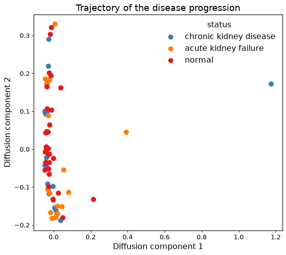

##### UMAP of the samples:
<div class="alert alert-block alert-info">
PILOT can also show the samples in a UMAP computed from the Wasserstein distances. Important parameters:

- `n_neighbors` (default 15, or fewer for small cohorts): small values keep the local structure, large values the global structure.
- `min_dist` (default 0.5): how close the points can be to each other.
</div>

```python
pl.pl.umap_samples(adata)
```

```
<Axes: title={'center': 'UMAP of samples'}, xlabel='UMAP 1', ylabel='UMAP 2'>
```

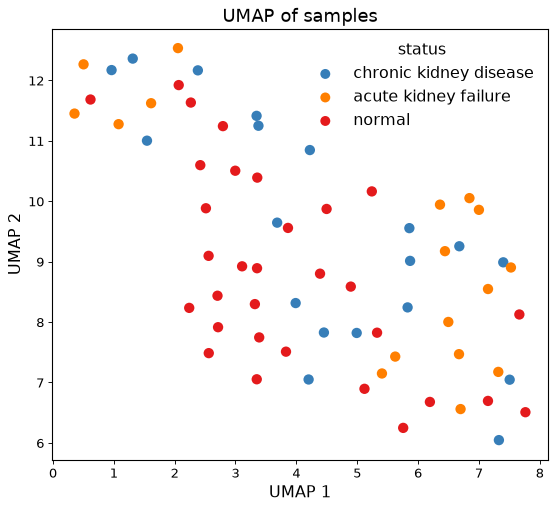

#####  Fit a principal graph:
<div class="alert alert-block alert-info">
The diffusion map creates an embedding that potentially reveals a trajectory in the data. Next, PILOT uses ElPiGraph to fit a principal graph (a tree) through the samples and orders the samples along it, starting from the root. This order is the disease progression score (pseudotime). See the main [tutorial](https://pilot.readthedocs.io/en/latest/Myocardial_infarction.html) for details. Here, the trajectory starts at the normal samples. Important parameters:

- `source_node`: the start (root) of the trajectory. With `'auto'`, PILOT chooses the end node of the graph where the samples of `root_status` come first. You can also give a node number (the numbers are shown in the plot).
- `root_status`: the group where the trajectory starts, here `'normal'`.
- `NumNodes` (default 20): number of nodes of the graph. More nodes give a more detailed curve.
</div>

```python
pl.pl.fit_pricipla_graph(adata, source_node = 'auto', root_status = 'normal')
```

```
Root of the trajectory: node 2 (end node where the control samples come first).
```

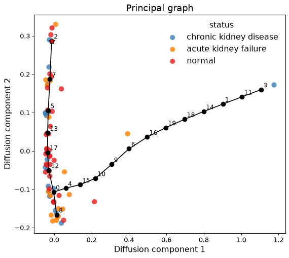

##### Clinical and technical variables on the trajectory:
<div class="alert alert-block alert-info">
The trajectory and the principal graph are computed from the status. To see how other information about the samples relates to the disease progression, PILOT can color the samples by any column of `adata.obs`, e.g. the sex of the donors or the degeneration score of the cells. The trajectory and the principal graph (grey, with the root as a red star) stay the same.

- Categorical variables (e.g. sex, batch) get one color per group.
- Numeric variables (e.g. age, or a technical value such as the percentage of mitochondrial reads) get a color scale. Values that are given per cell are averaged per sample (`agg = 'mean'`).
- `variable = 'pseudotime'` and `variable = 'n_cells'` (number of cells of each sample) can also be used.
</div>

```python
pl.pl.trajectory_variable(adata, variable = 'sex')
```

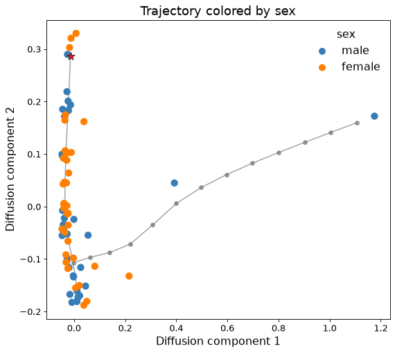

```python
pl.pl.trajectory_variable(adata, variable = 'degen.score')
```

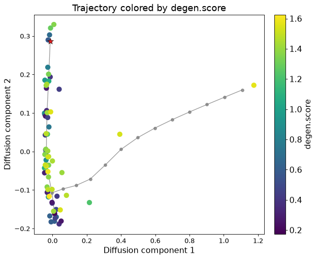

The same variables can be shown on the UMAP of the samples:

```python
pl.pl.umap_variable(adata, variable = 'sex')
```

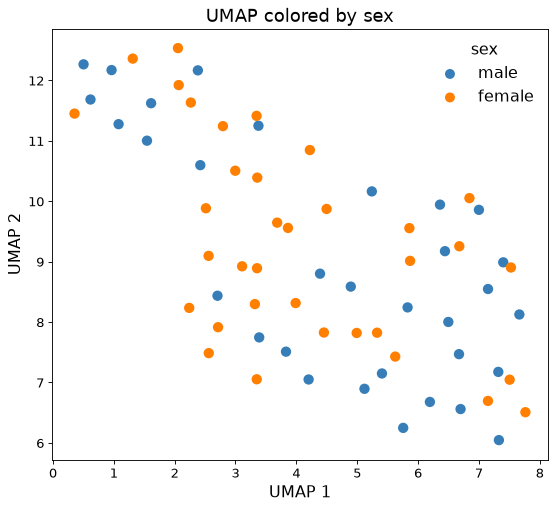

```python
pl.pl.umap_variable(adata, variable = 'degen.score')
```

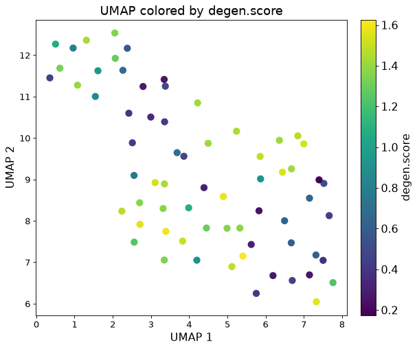

#####  Cell-type importance:
<div class="alert alert-block alert-info">
Next, we use a regression model to find cell types whose proportions change linearly or non-linearly with disease progression. 

`pl.tl.cell_importance_calculation` orders the samples along the trajectory and, for each cell type, fits a linear, a quadratic and a linear + quadratic model of its proportion, and keeps the best one. Important parameters:

- `p_val` (default 1): keep only the cell types with an adjusted p-value below this value; 1 keeps all of them.
- `x_axis`: `'order'` (default) places the samples at their position along the trajectory (1, 2, 3, ...); `'pseudotime'` uses the pseudotime values, so the distances between the samples are kept.

The results are saved in 'Results_PILOT/Cell_type_Report' and the cell types in `adata.uns['cellnames']`.
</div>

```python
pl.tl.cell_importance_calculation(adata)
```

The heatmap shows the cell type proportions (columns) of each sample (rows). The samples are ordered along the trajectory, from the start (top) to the end (bottom). Each cell type is scaled between 0 and 1, so its changes are easy to see.

```python
pl.pl.heatmap_proportions(adata)
```

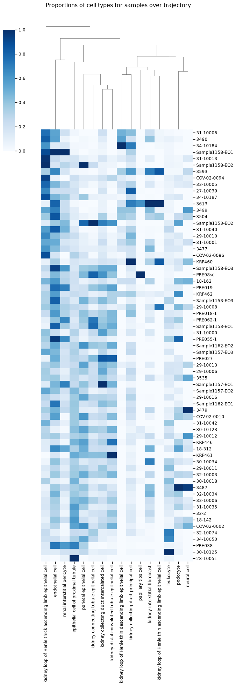

Each panel shows one cell type: its proportion in each sample (points) along the trajectory and the fitted curve. The panels are sorted by p-value; cell types with an adjusted p-value below 0.05 have a bold title. `pl.pl.cell_importance_plot(adata)` saves the same plots as one file per cell type (in 'Results_PILOT/Cell_types_importance'), and `pl.tl.cell_importance(adata)` runs these three steps in one call.

```python
pl.pl.cell_importance_grid(adata)
```

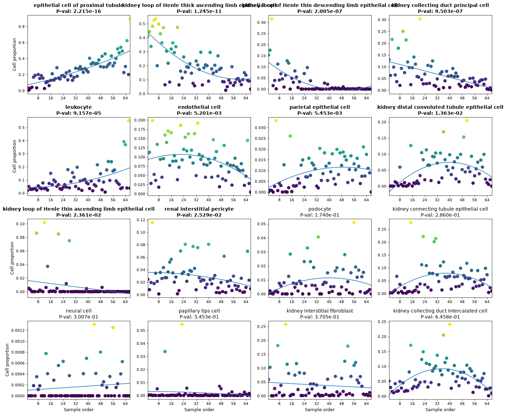

##### Evaluation of the association of estimated disease progression with experimental factor:
A very important question is if PILOT analysis is affected by experimental artefacts (location of tissues, batch processing). To evaluate this, PILOT tests the association between every variable describing the samples and the position of the samples on the trajectory.
<div class="alert alert-block alert-info">
`pl.tl.correlation_with_trajectory` does this automatically for **all** columns of `adata.obs`; you do not need to list the variables or say if they are categorical or numeric:

- Variables with one value per sample (e.g. sex, BMI, disease) are used directly. If only a few samples have more than one value (e.g. the tissue, when some donors have biopsies from two regions), the most frequent value of each sample is used.
- Numeric values given per cell (e.g. the degeneration score or the number of genes per cell) are averaged per sample (`agg = 'mean'`).
- The type is detected: numbers with at least 6 different values are numeric, everything else is categorical. Values such as 'unknown' or 'NA' are treated as missing.
- Columns that cannot be used are skipped, and the reason is reported: only one value, a different value for every sample (IDs), more than 50% missing values, a different value in most cells of a sample (e.g. the cell type), or the same information as another column (e.g. 'sex' and 'sex_ontology_term_id').
- Categorical variables are tested with ANOVA (and Kruskal-Wallis), numeric variables with a Spearman correlation. 'Adjusted_P_value' is corrected for multiple testing (Benjamini-Hochberg).

The result is one table with all variables, sorted by p-value. Use `features = [...]` to test only some columns.
</div>

```python
res = pl.tl.correlation_with_trajectory(adata, sample_col = 'donor_id')
res
```

```
Tested 29 variables (13 categorical, 16 numeric); skipped 28 columns.
  skipped (differs between the cells of a sample (cell-level)): subclass.full, subclass.l3, subclass.l2, subclass.l1, state.l2, state, class, structure, ...
  skipped (only one value): assay, organism, organism_ontology_term_id, assay_ontology_term_id
  skipped (same groups as 'development_stage'): development_stage_ontology_term_id
  skipped (same groups as 'disease'): condition.l1, disease_ontology_term_id
  skipped (same groups as 'percent.cortex'): percent.medulla
  skipped (same groups as 'self_reported_ethnicity'): self_reported_ethnicity_ontology_term_id
  skipped (same groups as 'sex'): sex_ontology_term_id
  skipped (same groups as 'suspension_type'): id
  skipped (same groups as 'tissue'): tissue_ontology_term_id
  skipped (too many different values (67 for 67 samples, e.g. an ID)): library, experiment, specimen
  skipped (too many missing values (35 of 67)): region.l1, region.l2
  skipped (too many missing values (37 of 67)): BMI
```

<table border="1" class="dataframe">
  <thead>
    <tr style="text-align: right;">
      <th></th>
      <th>Feature</th>
      <th>Type</th>
      <th>Level</th>
      <th>Test</th>
      <th>Statistic</th>
      <th>P_value</th>
      <th>Adjusted_P_value</th>
      <th>Kruskal_P_value</th>
      <th>N_samples</th>
      <th>N_groups</th>
      <th>Note</th>
    </tr>
  </thead>
  <tbody>
    <tr>
      <th>0</th>
      <td>percent.cortex</td>
      <td>numeric</td>
      <td>cell (mean)</td>
      <td>Spearman</td>
      <td>0.759392</td>
      <td>7.897742e-08</td>
      <td>0.000002</td>
      <td>NaN</td>
      <td>36</td>
      <td>14</td>
      <td></td>
    </tr>
    <tr>
      <th>1</th>
      <td>tissue</td>
      <td>categorical</td>
      <td>sample (most frequent)</td>
      <td>ANOVA</td>
      <td>8.945451</td>
      <td>5.067254e-05</td>
      <td>0.000554</td>
      <td>0.000194</td>
      <td>67</td>
      <td>4</td>
      <td></td>
    </tr>
    <tr>
      <th>2</th>
      <td>glycoprotein.score</td>
      <td>numeric</td>
      <td>cell (mean)</td>
      <td>Spearman</td>
      <td>-0.471107</td>
      <td>5.730664e-05</td>
      <td>0.000554</td>
      <td>NaN</td>
      <td>67</td>
      <td>67</td>
      <td></td>
    </tr>
    <tr>
      <th>3</th>
      <td>matrisome.score</td>
      <td>numeric</td>
      <td>cell (mean)</td>
      <td>Spearman</td>
      <td>-0.337617</td>
      <td>5.205204e-03</td>
      <td>0.037738</td>
      <td>NaN</td>
      <td>67</td>
      <td>67</td>
      <td></td>
    </tr>
    <tr>
      <th>4</th>
      <td>diabetes_history</td>
      <td>categorical</td>
      <td>sample</td>
      <td>ANOVA</td>
      <td>5.577724</td>
      <td>2.169314e-02</td>
      <td>0.125820</td>
      <td>0.016035</td>
      <td>58</td>
      <td>2</td>
      <td></td>
    </tr>
    <tr>
      <th>5</th>
      <td>nFeature_RNA</td>
      <td>numeric</td>
      <td>cell (mean)</td>
      <td>Spearman</td>
      <td>-0.265544</td>
      <td>2.986922e-02</td>
      <td>0.136152</td>
      <td>NaN</td>
      <td>67</td>
      <td>67</td>
      <td></td>
    </tr>
    <tr>
      <th>6</th>
      <td>condition.l2</td>
      <td>categorical</td>
      <td>sample</td>
      <td>ANOVA</td>
      <td>2.810723</td>
      <td>3.286437e-02</td>
      <td>0.136152</td>
      <td>0.038276</td>
      <td>67</td>
      <td>5</td>
      <td></td>
    </tr>
    <tr>
      <th>7</th>
      <td>proteoglycan.score</td>
      <td>numeric</td>
      <td>cell (mean)</td>
      <td>Spearman</td>
      <td>-0.254130</td>
      <td>3.796769e-02</td>
      <td>0.137633</td>
      <td>NaN</td>
      <td>67</td>
      <td>67</td>
      <td></td>
    </tr>
    <tr>
      <th>8</th>
      <td>condition.long</td>
      <td>categorical</td>
      <td>sample</td>
      <td>ANOVA</td>
      <td>2.358445</td>
      <td>5.060087e-02</td>
      <td>0.163047</td>
      <td>0.057843</td>
      <td>67</td>
      <td>6</td>
      <td></td>
    </tr>
    <tr>
      <th>9</th>
      <td>disease</td>
      <td>categorical</td>
      <td>sample</td>
      <td>ANOVA</td>
      <td>2.964253</td>
      <td>5.872502e-02</td>
      <td>0.170303</td>
      <td>0.060949</td>
      <td>67</td>
      <td>3</td>
      <td></td>
    </tr>
    <tr>
      <th>10</th>
      <td>self_reported_ethnicity</td>
      <td>categorical</td>
      <td>sample</td>
      <td>ANOVA</td>
      <td>3.046883</td>
      <td>8.618794e-02</td>
      <td>0.203004</td>
      <td>0.082357</td>
      <td>60</td>
      <td>2</td>
      <td>2 group(s) with &lt; 2 samples not tested</td>
    </tr>
    <tr>
      <th>11</th>
      <td>collagen.score</td>
      <td>numeric</td>
      <td>cell (mean)</td>
      <td>Spearman</td>
      <td>-0.208317</td>
      <td>9.070878e-02</td>
      <td>0.203004</td>
      <td>NaN</td>
      <td>67</td>
      <td>67</td>
      <td></td>
    </tr>
    <tr>
      <th>12</th>
      <td>tissue_type</td>
      <td>categorical</td>
      <td>sample</td>
      <td>ANOVA</td>
      <td>2.488925</td>
      <td>9.100189e-02</td>
      <td>0.203004</td>
      <td>0.092414</td>
      <td>67</td>
      <td>3</td>
      <td></td>
    </tr>
    <tr>
      <th>13</th>
      <td>pagoda_k100_infomap_coembed</td>
      <td>numeric</td>
      <td>cell (mean)</td>
      <td>Spearman</td>
      <td>0.194269</td>
      <td>1.151904e-01</td>
      <td>0.238609</td>
      <td>NaN</td>
      <td>67</td>
      <td>67</td>
      <td></td>
    </tr>
    <tr>
      <th>14</th>
      <td>sex</td>
      <td>categorical</td>
      <td>sample</td>
      <td>ANOVA</td>
      <td>2.234959</td>
      <td>1.397596e-01</td>
      <td>0.270202</td>
      <td>0.138557</td>
      <td>67</td>
      <td>2</td>
      <td></td>
    </tr>
    <tr>
      <th>15</th>
      <td>nCount_RNA</td>
      <td>numeric</td>
      <td>cell (mean)</td>
      <td>Spearman</td>
      <td>-0.166853</td>
      <td>1.771669e-01</td>
      <td>0.321115</td>
      <td>NaN</td>
      <td>67</td>
      <td>67</td>
      <td></td>
    </tr>
    <tr>
      <th>16</th>
      <td>percent.er</td>
      <td>numeric</td>
      <td>cell (mean)</td>
      <td>Spearman</td>
      <td>0.137920</td>
      <td>2.657050e-01</td>
      <td>0.453262</td>
      <td>NaN</td>
      <td>67</td>
      <td>67</td>
      <td></td>
    </tr>
    <tr>
      <th>17</th>
      <td>development_stage</td>
      <td>categorical</td>
      <td>sample</td>
      <td>ANOVA</td>
      <td>0.872606</td>
      <td>5.666207e-01</td>
      <td>0.893246</td>
      <td>0.606595</td>
      <td>45</td>
      <td>11</td>
      <td>22 group(s) with &lt; 2 samples not tested</td>
    </tr>
    <tr>
      <th>18</th>
      <td>aEpi.score</td>
      <td>numeric</td>
      <td>cell (mean)</td>
      <td>Spearman</td>
      <td>0.062176</td>
      <td>6.171899e-01</td>
      <td>0.893246</td>
      <td>NaN</td>
      <td>67</td>
      <td>67</td>
      <td></td>
    </tr>
    <tr>
      <th>19</th>
      <td>aStr.score</td>
      <td>numeric</td>
      <td>cell (mean)</td>
      <td>Spearman</td>
      <td>-0.047649</td>
      <td>7.017900e-01</td>
      <td>0.893246</td>
      <td>NaN</td>
      <td>67</td>
      <td>67</td>
      <td></td>
    </tr>
    <tr>
      <th>20</th>
      <td>cyc.score</td>
      <td>numeric</td>
      <td>cell (mean)</td>
      <td>Spearman</td>
      <td>0.046412</td>
      <td>7.091834e-01</td>
      <td>0.893246</td>
      <td>NaN</td>
      <td>67</td>
      <td>67</td>
      <td></td>
    </tr>
    <tr>
      <th>21</th>
      <td>degen.score</td>
      <td>numeric</td>
      <td>cell (mean)</td>
      <td>Spearman</td>
      <td>0.044656</td>
      <td>7.197233e-01</td>
      <td>0.893246</td>
      <td>NaN</td>
      <td>67</td>
      <td>67</td>
      <td></td>
    </tr>
    <tr>
      <th>22</th>
      <td>is_primary_data</td>
      <td>categorical</td>
      <td>sample</td>
      <td>ANOVA</td>
      <td>0.106106</td>
      <td>7.456678e-01</td>
      <td>0.893246</td>
      <td>0.742936</td>
      <td>67</td>
      <td>2</td>
      <td></td>
    </tr>
    <tr>
      <th>23</th>
      <td>hypertension</td>
      <td>categorical</td>
      <td>sample</td>
      <td>ANOVA</td>
      <td>0.081412</td>
      <td>7.764275e-01</td>
      <td>0.893246</td>
      <td>0.759006</td>
      <td>59</td>
      <td>2</td>
      <td></td>
    </tr>
    <tr>
      <th>24</th>
      <td>percent.mt</td>
      <td>numeric</td>
      <td>cell (mean)</td>
      <td>Spearman</td>
      <td>-0.033043</td>
      <td>7.906598e-01</td>
      <td>0.893246</td>
      <td>NaN</td>
      <td>67</td>
      <td>67</td>
      <td></td>
    </tr>
    <tr>
      <th>25</th>
      <td>eGFR</td>
      <td>categorical</td>
      <td>sample</td>
      <td>ANOVA</td>
      <td>0.409760</td>
      <td>8.008411e-01</td>
      <td>0.893246</td>
      <td>0.804826</td>
      <td>60</td>
      <td>5</td>
      <td></td>
    </tr>
    <tr>
      <th>26</th>
      <td>S.Score</td>
      <td>numeric</td>
      <td>cell (mean)</td>
      <td>Spearman</td>
      <td>-0.019315</td>
      <td>8.767104e-01</td>
      <td>0.941652</td>
      <td>NaN</td>
      <td>67</td>
      <td>67</td>
      <td></td>
    </tr>
    <tr>
      <th>27</th>
      <td>suspension_type</td>
      <td>categorical</td>
      <td>sample (most frequent)</td>
      <td>ANOVA</td>
      <td>0.007604</td>
      <td>9.307776e-01</td>
      <td>0.963443</td>
      <td>0.929982</td>
      <td>67</td>
      <td>2</td>
      <td></td>
    </tr>
    <tr>
      <th>28</th>
      <td>G2M.Score</td>
      <td>numeric</td>
      <td>cell (mean)</td>
      <td>Spearman</td>
      <td>0.005707</td>
      <td>9.634432e-01</td>
      <td>0.963443</td>
      <td>NaN</td>
      <td>67</td>
      <td>67</td>
      <td></td>
    </tr>
  </tbody>
</table>

The skipped columns, and why:

```python
adata.uns['trajectory_associations_skipped']
```

<table border="1" class="dataframe">
  <thead>
    <tr style="text-align: right;">
      <th></th>
      <th>Feature</th>
      <th>Type</th>
      <th>Level</th>
      <th>N_samples</th>
      <th>N_groups</th>
      <th>Reason</th>
    </tr>
  </thead>
  <tbody>
    <tr>
      <th>0</th>
      <td>library</td>
      <td>skipped</td>
      <td>sample (most frequent)</td>
      <td>0</td>
      <td>0</td>
      <td>too many different values (67 for 67 samples, e.g. an ID)</td>
    </tr>
    <tr>
      <th>1</th>
      <td>experiment</td>
      <td>skipped</td>
      <td>sample (most frequent)</td>
      <td>0</td>
      <td>0</td>
      <td>too many different values (67 for 67 samples, e.g. an ID)</td>
    </tr>
    <tr>
      <th>2</th>
      <td>specimen</td>
      <td>skipped</td>
      <td>sample (most frequent)</td>
      <td>0</td>
      <td>0</td>
      <td>too many different values (67 for 67 samples, e.g. an ID)</td>
    </tr>
    <tr>
      <th>3</th>
      <td>condition.l1</td>
      <td>skipped</td>
      <td>sample</td>
      <td>67</td>
      <td>3</td>
      <td>same groups as 'disease'</td>
    </tr>
    <tr>
      <th>4</th>
      <td>region.l1</td>
      <td>skipped</td>
      <td>sample (most frequent)</td>
      <td>32</td>
      <td>0</td>
      <td>too many missing values (35 of 67)</td>
    </tr>
    <tr>
      <th>5</th>
      <td>region.l2</td>
      <td>skipped</td>
      <td>sample (most frequent)</td>
      <td>32</td>
      <td>0</td>
      <td>too many missing values (35 of 67)</td>
    </tr>
    <tr>
      <th>6</th>
      <td>percent.medulla</td>
      <td>skipped</td>
      <td>cell (mean)</td>
      <td>36</td>
      <td>14</td>
      <td>same groups as 'percent.cortex'</td>
    </tr>
    <tr>
      <th>7</th>
      <td>subclass.full</td>
      <td>skipped</td>
      <td>cell</td>
      <td>0</td>
      <td>0</td>
      <td>differs between the cells of a sample (cell-level)</td>
    </tr>
    <tr>
      <th>8</th>
      <td>subclass.l3</td>
      <td>skipped</td>
      <td>cell</td>
      <td>0</td>
      <td>0</td>
      <td>differs between the cells of a sample (cell-level)</td>
    </tr>
    <tr>
      <th>9</th>
      <td>subclass.l2</td>
      <td>skipped</td>
      <td>cell</td>
      <td>0</td>
      <td>0</td>
      <td>differs between the cells of a sample (cell-level)</td>
    </tr>
    <tr>
      <th>10</th>
      <td>subclass.l1</td>
      <td>skipped</td>
      <td>cell</td>
      <td>0</td>
      <td>0</td>
      <td>differs between the cells of a sample (cell-level)</td>
    </tr>
    <tr>
      <th>11</th>
      <td>state.l2</td>
      <td>skipped</td>
      <td>cell</td>
      <td>0</td>
      <td>0</td>
      <td>differs between the cells of a sample (cell-level)</td>
    </tr>
    <tr>
      <th>12</th>
      <td>state</td>
      <td>skipped</td>
      <td>cell</td>
      <td>0</td>
      <td>0</td>
      <td>differs between the cells of a sample (cell-level)</td>
    </tr>
    <tr>
      <th>13</th>
      <td>class</td>
      <td>skipped</td>
      <td>cell</td>
      <td>0</td>
      <td>0</td>
      <td>differs between the cells of a sample (cell-level)</td>
    </tr>
    <tr>
      <th>14</th>
      <td>structure</td>
      <td>skipped</td>
      <td>cell</td>
      <td>0</td>
      <td>0</td>
      <td>differs between the cells of a sample (cell-level)</td>
    </tr>
    <tr>
      <th>15</th>
      <td>BMI</td>
      <td>skipped</td>
      <td>sample</td>
      <td>30</td>
      <td>0</td>
      <td>too many missing values (37 of 67)</td>
    </tr>
    <tr>
      <th>16</th>
      <td>cell_type</td>
      <td>skipped</td>
      <td>cell</td>
      <td>0</td>
      <td>0</td>
      <td>differs between the cells of a sample (cell-level)</td>
    </tr>
    <tr>
      <th>17</th>
      <td>assay</td>
      <td>skipped</td>
      <td>sample</td>
      <td>67</td>
      <td>1</td>
      <td>only one value</td>
    </tr>
    <tr>
      <th>18</th>
      <td>organism</td>
      <td>skipped</td>
      <td>sample</td>
      <td>67</td>
      <td>1</td>
      <td>only one value</td>
    </tr>
    <tr>
      <th>19</th>
      <td>id</td>
      <td>skipped</td>
      <td>sample (most frequent)</td>
      <td>67</td>
      <td>2</td>
      <td>same groups as 'suspension_type'</td>
    </tr>
    <tr>
      <th>20</th>
      <td>disease_ontology_term_id</td>
      <td>skipped</td>
      <td>sample</td>
      <td>67</td>
      <td>3</td>
      <td>same groups as 'disease'</td>
    </tr>
    <tr>
      <th>21</th>
      <td>sex_ontology_term_id</td>
      <td>skipped</td>
      <td>sample</td>
      <td>67</td>
      <td>2</td>
      <td>same groups as 'sex'</td>
    </tr>
    <tr>
      <th>22</th>
      <td>development_stage_ontology_term_id</td>
      <td>skipped</td>
      <td>sample</td>
      <td>45</td>
      <td>11</td>
      <td>same groups as 'development_stage'</td>
    </tr>
    <tr>
      <th>23</th>
      <td>self_reported_ethnicity_ontology_term_id</td>
      <td>skipped</td>
      <td>sample</td>
      <td>60</td>
      <td>2</td>
      <td>same groups as 'self_reported_ethnicity'</td>
    </tr>
    <tr>
      <th>24</th>
      <td>tissue_ontology_term_id</td>
      <td>skipped</td>
      <td>sample (most frequent)</td>
      <td>67</td>
      <td>4</td>
      <td>same groups as 'tissue'</td>
    </tr>
    <tr>
      <th>25</th>
      <td>organism_ontology_term_id</td>
      <td>skipped</td>
      <td>sample</td>
      <td>67</td>
      <td>1</td>
      <td>only one value</td>
    </tr>
    <tr>
      <th>26</th>
      <td>assay_ontology_term_id</td>
      <td>skipped</td>
      <td>sample</td>
      <td>67</td>
      <td>1</td>
      <td>only one value</td>
    </tr>
    <tr>
      <th>27</th>
      <td>cell_type_ontology_term_id</td>
      <td>skipped</td>
      <td>cell</td>
      <td>0</td>
      <td>0</td>
      <td>differs between the cells of a sample (cell-level)</td>
    </tr>
  </tbody>
</table>

##### The significant variables on the trajectory:
<div class="alert alert-block alert-info">
`pl.pl.trajectory_associations` shows the variables with p-value < 0.05 (at most `top = 6`) on the trajectory, each in its own panel, with the test and the p-value in the title. With `basis = 'umap'` the same variables are shown on the UMAP of the samples. Use `variables = [...]` to choose the variables yourself.
</div>

```python
pl.pl.trajectory_associations(adata)
```

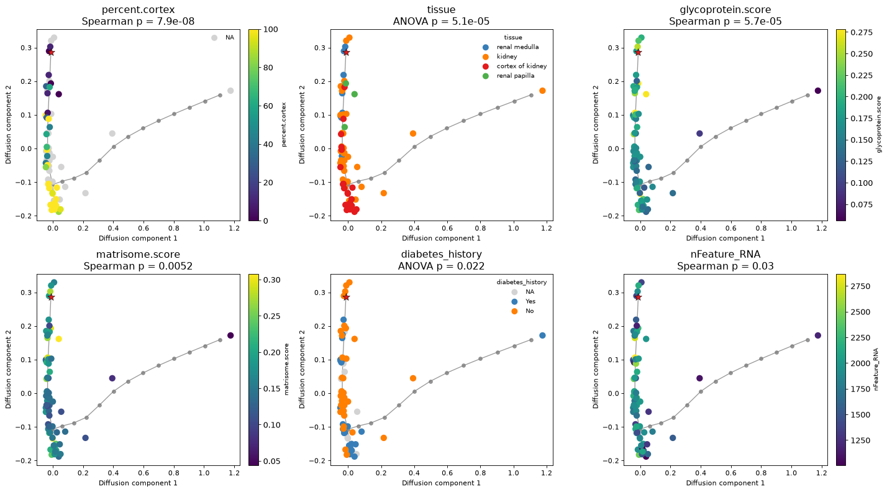

```python
pl.pl.trajectory_associations(adata, basis = 'umap')
```

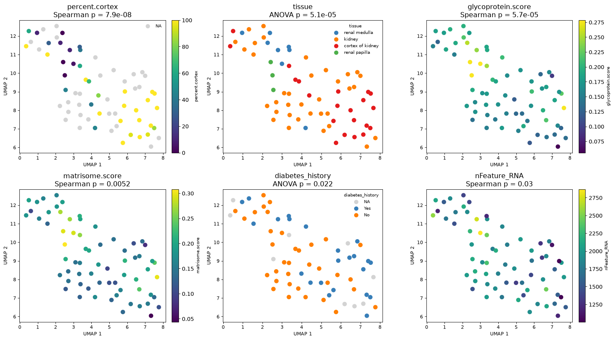

<div class="alert alert-block alert-info">
The functions of earlier versions, where you list the variables and their type yourself, still work: `pl.tl.correlation_categorical_with_trajectory(adata, sample_col = 'donor_id', features = [...])` and `pl.tl.correlation_numeric_with_trajectory(adata, sample_col = 'donor_id', features = [...])`.
</div>

We observe that there is a clear association between the trajectory and the origin of the biopsies (`tissue`, and `percent.cortex`, the fraction of cortex in the biopsy). This is not surprising as PILOT uses cellular composition information, as samples at distinct regions do have distinct cells. Among the gene signature scores (see the data manuscript for details: https://doi.org/10.1038/s41586-023-05769-3), the glycoprotein and matrisome scores (averaged over the cells of each sample) are associated with the trajectory.

Note: earlier versions of this tutorial reported an association with the `degen.score`. The earlier functions used the score of one cell per sample (the first cell); the average over all cells of a sample, which is used now, is not associated with the trajectory.

To double check these results, one can of course plot the trajectory by showing the location as labels.

###### Tissue

```python
palette = sns.color_palette("husl", len(adata.obs['tissue'].unique()))
colors = [palette[i] for i in range(len(adata.obs['tissue'].unique()))]
pl.tl.wasserstein_distance(
    adata,
    emb_matrix = 'X_pca',
    clusters_col = 'cell_type',
    sample_col = 'donor_id',
    status = 'tissue'
    )
```

```python
pl.pl.trajectory(adata, colors = colors)
```

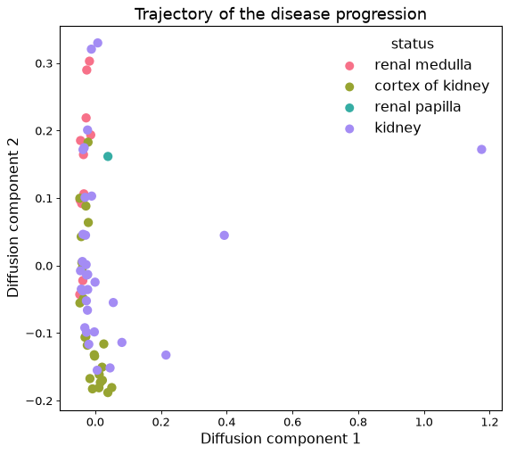

#### Filtering of samples

Therefore, we only focus on biopsies from sample locationn 'kidney', which were used in our benchmarking. You can download the Anndata (h5ad) file from [here](https://costalab.ukaachen.de/open_data/PILOT/Kidney_filtered.h5ad), and place it in the _Datasets_ folder.


```python
adata_filtered=sc.read_h5ad('/Datasets/Kidney.h5ad')
```


```python
pl.tl.wasserstein_distance(
    adata_filtered,
    emb_matrix  ='X_pca',
    clusters_col='cell_type',
    sample_col='donor_id',
    status='disease'
    )
```


```python
pl.pl.trajectory(adata_filtered, colors = ['red','orange','Blue'])
```


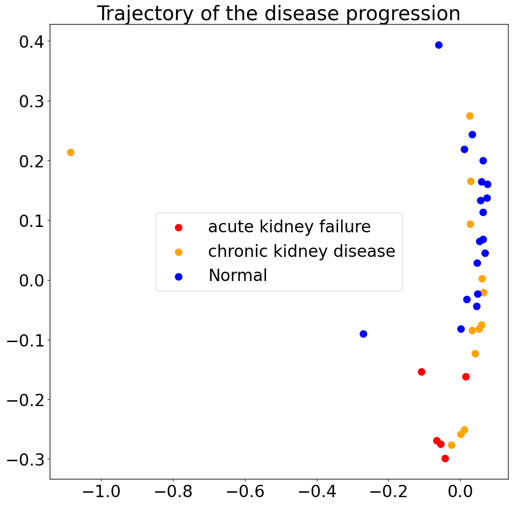


##### Categorical variables 

We next recheck the association of variables with the estimated trajectory. 


```python
pl.tl.correlation_categorical_with_trajectory(adata_filtered, sample_col='donor_id', features=['BMI','hypertension','development_stage','sex','eGFR','diabetes_history','disease'])
```


<div>
<style scoped>
    .dataframe tbody tr th:only-of-type {
        vertical-align: middle;
    }

    .dataframe tbody tr th {
        vertical-align: top;
    }

    .dataframe thead th {
        text-align: right;
    }
</style>
<table border="1" class="dataframe">
  <thead>
    <tr style="text-align: right;">
      <th></th>
      <th>Feature</th>
      <th>ANOVA_FStatistic</th>
      <th>ANOVA_PValue</th>
    </tr>
  </thead>
  <tbody>
    <tr>
      <th>6</th>
      <td>disease</td>
      <td>9.457675</td>
      <td>0.000566</td>
    </tr>
    <tr>
      <th>5</th>
      <td>diabetes_history</td>
      <td>12.517843</td>
      <td>0.001189</td>
    </tr>
    <tr>
      <th>0</th>
      <td>BMI</td>
      <td>3.969681</td>
      <td>0.016358</td>
    </tr>
  </tbody>
</table>
</div>


```python

```

We observed data the true label (disease) has highest association followed by BMI or Diabetes History. While the latter are two clinical factors with a impact on kidney disease, as closer investigation of the variables indicates these association as spurious, as only controls have BMI values and most disease are diabetic. 

##### Diabetes_history


```python
contingency_table = pd.crosstab(adata_filtered.obs['disease'], adata_filtered.obs['diabetes_history'],values=adata_filtered.obs['donor_id'], aggfunc=pd.Series.nunique, margins=True, margins_name='Total Unique Patients')
contingency_table
```


<div>
<style scoped>
    .dataframe tbody tr th:only-of-type {
        vertical-align: middle;
    }

    .dataframe tbody tr th {
        vertical-align: top;
    }

    .dataframe thead th {
        text-align: right;
    }
</style>
<table border="1" class="dataframe">
  <thead>
    <tr style="text-align: right;">
      <th>diabetes_history</th>
      <th>No</th>
      <th>Yes</th>
      <th>Total Unique Patients</th>
    </tr>
    <tr>
      <th>disease</th>
      <th></th>
      <th></th>
      <th></th>
    </tr>
  </thead>
  <tbody>
    <tr>
      <th>Normal</th>
      <td>18.0</td>
      <td>NaN</td>
      <td>18</td>
    </tr>
    <tr>
      <th>acute kidney failure</th>
      <td>NaN</td>
      <td>5.0</td>
      <td>5</td>
    </tr>
    <tr>
      <th>chronic kidney disease</th>
      <td>NaN</td>
      <td>13.0</td>
      <td>13</td>
    </tr>
    <tr>
      <th>Total Unique Patients</th>
      <td>18.0</td>
      <td>18.0</td>
      <td>36</td>
    </tr>
  </tbody>
</table>
</div>


```python

```

##### BMI


```python
contingency_table = pd.crosstab(adata_filtered.obs['disease'], adata_filtered.obs['BMI'],values=adata_filtered.obs['donor_id'], aggfunc=pd.Series.nunique, margins=True, margins_name='Total Unique Patients')
contingency_table
```


<div>
<style scoped>
    .dataframe tbody tr th:only-of-type {
        vertical-align: middle;
    }

    .dataframe tbody tr th {
        vertical-align: top;
    }

    .dataframe thead th {
        text-align: right;
    }
</style>
<table border="1" class="dataframe">
  <thead>
    <tr style="text-align: right;">
      <th>BMI</th>
      <th>18.5—24.9</th>
      <th>25.0—29.9</th>
      <th>30.0 and Above</th>
      <th>unknown</th>
      <th>Total Unique Patients</th>
    </tr>
    <tr>
      <th>disease</th>
      <th></th>
      <th></th>
      <th></th>
      <th></th>
      <th></th>
    </tr>
  </thead>
  <tbody>
    <tr>
      <th>Normal</th>
      <td>2.0</td>
      <td>11.0</td>
      <td>4.0</td>
      <td>1.0</td>
      <td>18</td>
    </tr>
    <tr>
      <th>acute kidney failure</th>
      <td>NaN</td>
      <td>NaN</td>
      <td>NaN</td>
      <td>5.0</td>
      <td>5</td>
    </tr>
    <tr>
      <th>chronic kidney disease</th>
      <td>NaN</td>
      <td>NaN</td>
      <td>NaN</td>
      <td>13.0</td>
      <td>13</td>
    </tr>
    <tr>
      <th>Total Unique Patients</th>
      <td>2.0</td>
      <td>11.0</td>
      <td>4.0</td>
      <td>19.0</td>
      <td>36</td>
    </tr>
  </tbody>
</table>
</div>


