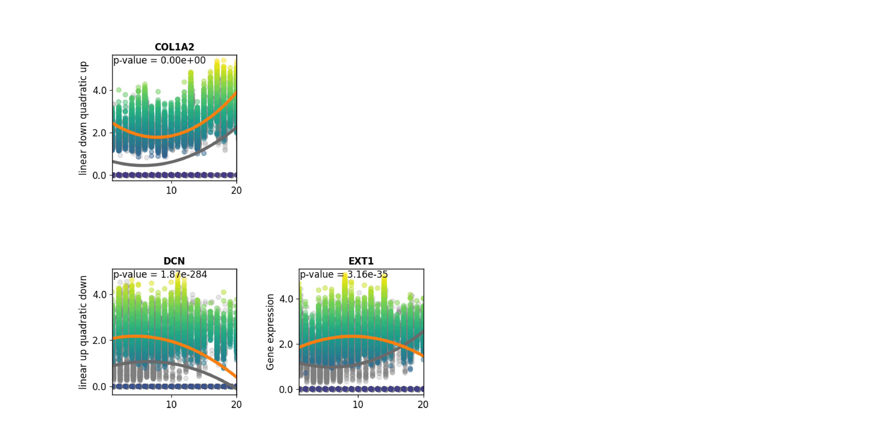

### Trajectory analysis of Myocardial Infarction using PILOT

<div class="alert alert-block alert-info">
<b>PILOT</b>

Welcome to the PILOT Package Tutorial for scRNA Data!

Here we show the whole process for applying PILOT to scRNA data using Myocardial Infarction scRNA Data, you can download the Anndata (h5ad) file from [here](https://costalab.ukaachen.de/open_data/PILOT/myocardial_infarction.h5ad).

</div>


```python
import PILOT as pl
import scanpy as sc
```

##### Reading Anndata


```python
adata=sc.read_h5ad('/Datasets/myocardial_infarction.h5ad')
```

###### Loading the required information and computing the Wasserstein distance:
<div class="alert alert-block alert-info"> In order to work with PILOT, ensure that your Anndata object is loaded and contains the required information.
    
Use the following parameters to configure PILOT for your analysis (Setting Parameters):
    
adata: Pass your loaded Anndata object to PILOT.
    
emb_matrix: Provide the name of the variable in the obsm level that holds the dimension reduction (PCA representation).
    
clusters_col: Specify the name of the column in the observation level of your Anndata that corresponds to cell types or clusters.
    
sample_col: Indicate the column name in the observation level of your Anndata that contains information about samples or patients.
    
status: Provide the column name that represents the status or disease (e.g., "control" or "case").
       
</div>


```python
pl.tl.wasserstein_distance(adata,emb_matrix='PCA',
clusters_col='cell_subtype',sample_col='sampleID',status='Status')
```

##### Ploting the Cost matrix and the Wasserstein distance:
<div class="alert alert-block alert-info"> 
 Here we show the heatmaps of Cost matrix (cells) and Wasserstein distance (samples).      
</div>


```python
pl.pl.heatmaps(adata)
```


    

    


    

    


##### Trajectory:
<div class="alert alert-block alert-info"> 
 Here we show the Diffusion map of Wasserstein distance.
</div>


```python
pl.pl.trajectory(adata,colors=['Blue','red'])
```


    

    


#####  Fit a principal graph:
<div class="alert alert-block alert-info"> 
The difussion map creates an embeding that potentially reveals a trajectory in the data. Next, PILOT explores EIPLGraph to find the structure of the trajectory. An important parameter is the source_node, which indicate the start of the trajectory. Here, we selected a control sample. This method returns a rank samples, which we define as a disease progression score (t = t1, ..., tn), where tl represents the ranking of the nth sample.
</div>


```python
pl.pl.fit_pricipla_graph(adata,source_node=7)
```


    

    


#####  Cell-type importance:
<div class="alert alert-block alert-info"> 
Next, we can use the robust regression model to find cells whose proportions change linearly or non-linearly with disease progression. As indicated in the paper, major halmarks of MI progression are detected, i.e., a decrease of cardiomyocyte cells (CM) and an increase of fibroblasts and myeloid cells.
</div>


```python
pl.tl.cell_importance(adata)
```


    

    


    

    


##### Applyin PILOT for finding Markers

##### Gene selection:
<div class="alert alert-block alert-info"> 
Given that we found interesting cell types, we would like next to investigate genes associated with these trajectories, i.e. genes, which expression changes linear or quadratically with the disease progression. After running the command, you can find a folder named ‘Markers’. There, we will have a folder for each cell type. The file ‘Whole_expressions.csv’ contains all statistics associated with genes for that cell type. Here, we run the genes_importance function for whole cell types.
    
* You need to set names of columns that show cell_types/clusters and Samples/Patinets in your object.
</div>


```python
for cell in adata.uns['cellnames']:
    pl.tl.genes_importance(adata,name_cell=cell,sample_col='sampleID',col_cell='cell_subtype',plot_genes=False)
```

    


##### Cluster Specific Marker Changes:
<div class="alert alert-block alert-info"> 
The previous test, only finds genes with significant changes over time for a given cell type. However, it does not consider if a similar pattern and expression values are found in other clusters. To test this, we use a Wald test that compares the fit of the gene in the cluster vs. the fit of the gene in other clusters.

The code snippet below emphasizes genes associated with ‘healthy CM’ and ‘Myofib’. Results are saved in ‘gene_clusters_stats_extend.csv’. You can also see the plots of significant marker genes at “plots_gene_cluster_differentiation”. There, the orange line indicates the fit in the target cell type (shown as orange lines) compared to other cell types (represented by grey lines) 
</div>


```python
pl.tl.gene_cluster_differentiation(cellnames=['healthy_CM','Myofib'],number_genes=70)
```

    


##### Exploring the results for a specific cell type :
<div class="alert alert-block alert-info"> 
For example, if we want to find the same myofibroblast genes as reported in the manuscript, we can do the following. To assist you in exploring the results, we offer a function called ‘results_gene_cluster_differentiation’. This function enables you to sort the results according to your preferences. For instance, if you’re interested in obtaining genes related to ‘Myofib’, you can use the function to first filter genes with larger FC than 0.5 and then sort the results based on p-values. This allows you to gain insights into the most relevant genes for your specific analysis.
</div>


```python
pl.tl.results_gene_cluster_differentiation(cluster_name='Myofib').head(10)
```


<div>
<style scoped>
    .dataframe tbody tr th:only-of-type {
        vertical-align: middle;
    }

    .dataframe tbody tr th {
        vertical-align: top;
    }

    .dataframe thead th {
        text-align: right;
    }
</style>
<table border="1" class="dataframe">
  <thead>
    <tr style="text-align: right;">
      <th></th>
      <th>gene</th>
      <th>cluster</th>
      <th>waldStat</th>
      <th>pvalue</th>
      <th>FC</th>
      <th>Expression pattern</th>
      <th>fit-pvalue</th>
      <th>fit-mod-rsquared</th>
    </tr>
  </thead>
  <tbody>
    <tr>
      <th>5775</th>
      <td>RORA</td>
      <td>Myofib</td>
      <td>1461.764959</td>
      <td>0.000000e+00</td>
      <td>0.899459</td>
      <td>quadratic down</td>
      <td>7.232834e-174</td>
      <td>0.587234</td>
    </tr>
    <tr>
      <th>2642</th>
      <td>GAS7</td>
      <td>Myofib</td>
      <td>1120.683802</td>
      <td>1.184877e-242</td>
      <td>1.086644</td>
      <td>linear up quadratic down</td>
      <td>1.873033e-107</td>
      <td>0.570704</td>
    </tr>
    <tr>
      <th>2151</th>
      <td>EXT1</td>
      <td>Myofib</td>
      <td>146.307312</td>
      <td>1.649235e-31</td>
      <td>0.786136</td>
      <td>linear up quadratic down</td>
      <td>3.159831e-35</td>
      <td>0.555757</td>
    </tr>
    <tr>
      <th>1437</th>
      <td>COL6A3</td>
      <td>Myofib</td>
      <td>95.945158</td>
      <td>1.156600e-20</td>
      <td>1.069156</td>
      <td>linear down quadratic up</td>
      <td>3.514298e-172</td>
      <td>0.608543</td>
    </tr>
    <tr>
      <th>1231</th>
      <td>CHD9</td>
      <td>Myofib</td>
      <td>60.300667</td>
      <td>5.070009e-13</td>
      <td>0.527488</td>
      <td>linear up quadratic down</td>
      <td>7.658862e-77</td>
      <td>0.559604</td>
    </tr>
    <tr>
      <th>2824</th>
      <td>GSN</td>
      <td>Myofib</td>
      <td>41.793611</td>
      <td>4.437819e-09</td>
      <td>0.638136</td>
      <td>linear up quadratic down</td>
      <td>2.942472e-279</td>
      <td>0.601684</td>
    </tr>
    <tr>
      <th>1710</th>
      <td>DCN</td>
      <td>Myofib</td>
      <td>27.320866</td>
      <td>5.042427e-06</td>
      <td>1.033697</td>
      <td>linear up quadratic down</td>
      <td>1.866152e-284</td>
      <td>0.588602</td>
    </tr>
    <tr>
      <th>5929</th>
      <td>SEC24D</td>
      <td>Myofib</td>
      <td>22.793274</td>
      <td>4.459441e-05</td>
      <td>0.806642</td>
      <td>linear down quadratic up</td>
      <td>6.604860e-64</td>
      <td>0.522700</td>
    </tr>
    <tr>
      <th>1372</th>
      <td>COL1A2</td>
      <td>Myofib</td>
      <td>17.891454</td>
      <td>4.631138e-04</td>
      <td>1.327753</td>
      <td>linear down quadratic up</td>
      <td>0.000000e+00</td>
      <td>0.655032</td>
    </tr>
    <tr>
      <th>2832</th>
      <td>GXYLT2</td>
      <td>Myofib</td>
      <td>16.558622</td>
      <td>8.709144e-04</td>
      <td>2.000205</td>
      <td>linear up quadratic down</td>
      <td>2.402171e-85</td>
      <td>0.537920</td>
    </tr>
  </tbody>
</table>
</div>


```python
pl.tl.exploring_specific_genes(cluster_name='Myofib',gene_list=['COL1A2','DCN','EXT1'])
```


    <Figure size 6400x5600 with 0 Axes>


    <Figure size 6400x5600 with 0 Axes>


    <Figure size 6400x5600 with 0 Axes>


    <Figure size 6400x5600 with 0 Axes>


    <Figure size 6400x5600 with 0 Axes>


    <Figure size 6400x5600 with 0 Axes>


    

    


<div class="alert alert-block alert-info"> 
The same criteria for healthy_CM cell type.
</div>


```python
pl.tl.results_gene_cluster_differentiation(cluster_name='healthy_CM').head(10)
```


<div>
<style scoped>
    .dataframe tbody tr th:only-of-type {
        vertical-align: middle;
    }

    .dataframe tbody tr th {
        vertical-align: top;
    }

    .dataframe thead th {
        text-align: right;
    }
</style>
<table border="1" class="dataframe">
  <thead>
    <tr style="text-align: right;">
      <th></th>
      <th>gene</th>
      <th>cluster</th>
      <th>waldStat</th>
      <th>pvalue</th>
      <th>FC</th>
      <th>Expression pattern</th>
      <th>fit-pvalue</th>
      <th>fit-mod-rsquared</th>
    </tr>
  </thead>
  <tbody>
    <tr>
      <th>4056</th>
      <td>MYBPC3</td>
      <td>healthy_CM</td>
      <td>1845.821359</td>
      <td>0.000000e+00</td>
      <td>0.686940</td>
      <td>linear up quadratic down</td>
      <td>0.000000e+00</td>
      <td>0.557570</td>
    </tr>
    <tr>
      <th>729</th>
      <td>C15orf41</td>
      <td>healthy_CM</td>
      <td>724.671481</td>
      <td>9.379853e-157</td>
      <td>1.310601</td>
      <td>linear down quadratic up</td>
      <td>1.773534e-200</td>
      <td>0.556761</td>
    </tr>
    <tr>
      <th>3281</th>
      <td>LDB3</td>
      <td>healthy_CM</td>
      <td>656.486992</td>
      <td>5.713129e-142</td>
      <td>1.426196</td>
      <td>linear down quadratic up</td>
      <td>1.511694e-238</td>
      <td>0.546327</td>
    </tr>
    <tr>
      <th>1071</th>
      <td>CDH2</td>
      <td>healthy_CM</td>
      <td>454.785922</td>
      <td>2.994244e-98</td>
      <td>1.556840</td>
      <td>quadratic down</td>
      <td>5.715370e-59</td>
      <td>0.524421</td>
    </tr>
    <tr>
      <th>1276</th>
      <td>CMYA5</td>
      <td>healthy_CM</td>
      <td>397.294439</td>
      <td>8.534816e-86</td>
      <td>1.559703</td>
      <td>linear down quadratic up</td>
      <td>3.774063e-66</td>
      <td>0.527869</td>
    </tr>
    <tr>
      <th>4747</th>
      <td>PDE1C</td>
      <td>healthy_CM</td>
      <td>381.616277</td>
      <td>2.123076e-82</td>
      <td>1.317905</td>
      <td>linear down quadratic up</td>
      <td>0.000000e+00</td>
      <td>0.591473</td>
    </tr>
    <tr>
      <th>2724</th>
      <td>GPC5</td>
      <td>healthy_CM</td>
      <td>342.819206</td>
      <td>5.351668e-74</td>
      <td>0.940037</td>
      <td>quadratic up</td>
      <td>5.506685e-207</td>
      <td>0.532028</td>
    </tr>
    <tr>
      <th>5718</th>
      <td>RNF150</td>
      <td>healthy_CM</td>
      <td>334.905459</td>
      <td>2.766278e-72</td>
      <td>1.387484</td>
      <td>linear down quadratic up</td>
      <td>0.000000e+00</td>
      <td>0.577805</td>
    </tr>
    <tr>
      <th>6466</th>
      <td>SVIL</td>
      <td>healthy_CM</td>
      <td>276.206091</td>
      <td>1.401942e-59</td>
      <td>0.949376</td>
      <td>linear down</td>
      <td>6.592469e-10</td>
      <td>0.517454</td>
    </tr>
    <tr>
      <th>4578</th>
      <td>PALLD</td>
      <td>healthy_CM</td>
      <td>245.180527</td>
      <td>7.213877e-53</td>
      <td>0.895723</td>
      <td>linear down quadratic up</td>
      <td>2.137328e-320</td>
      <td>0.558163</td>
    </tr>
  </tbody>
</table>
</div>


```python

```


```python

```


```python

```
