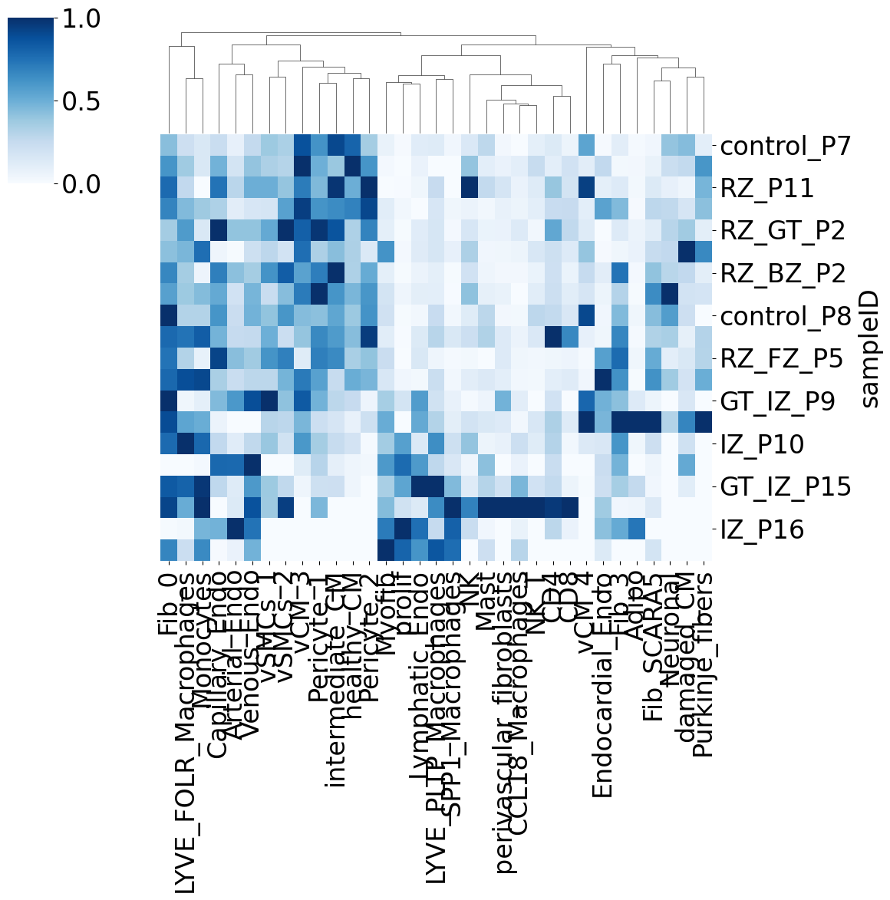
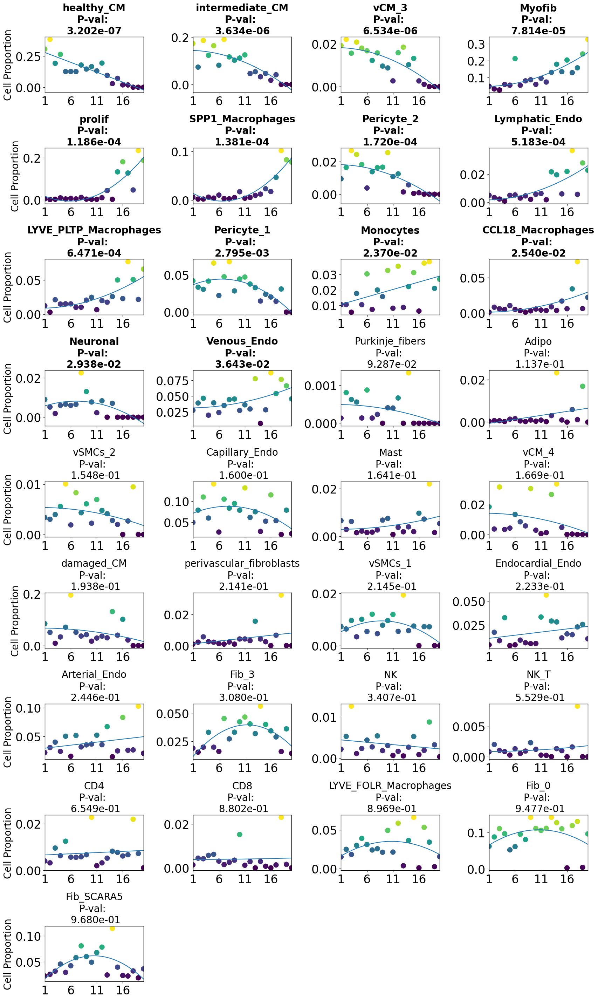

### Trajectory analysis of Myocardial Infarction using PILOT

<div class="alert alert-block alert-info">
<b>PILOT</b>

Welcome to the PILOT Package Tutorial for scRNA Data!

Here we show the whole process for applying PILOT to scRNA data using Myocardial Infarction scRNA Data, you can download the Anndata (h5ad) file from [here](https://costalab.ukaachen.de/open_data/PILOT/myocardial_infarction.h5ad), and place it in the _Datasets_ folder.

</div>


```python
import pilotpy as pl
import scanpy as sc
```

##### Reading Anndata


```python
adata = sc.read_h5ad('Datasets/myocardial_infarction.h5ad')
```

###### Loading the required information and computing the Wasserstein distance:
<div class="alert alert-block alert-info"> In order to work with PILOT, ensure that your Anndata object is loaded and contains the required information.
    
Use the following parameters to configure PILOT for your analysis (Setting Parameters):
    
- adata: Pass your loaded Anndata object to PILOT.
    
- emb_matrix: Provide the name of the variable in the obsm level that holds the dimension reduction (PCA representation).
    
- clusters_col: Specify the name of the column in the observation level of your Anndata that corresponds to cell types or clusters.
    
- sample_col: Indicate the column name in the observation level of your Anndata that contains information about samples or patients.
    
- status: Provide the column name that represents the status or disease (e.g., "control" or "case").
       
</div>


```python
pl.tl.wasserstein_distance(
    adata,
    emb_matrix = 'PCA',
    clusters_col = 'cell_subtype',
    sample_col = 'sampleID',
    status = 'Status',
    )
```

##### Ploting the Cost matrix and the Wasserstein distance:
<div class="alert alert-block alert-info"> 
Here we show the heatmaps of Cost matrix (cells) and Wasserstein distance (samples). At this point, you should have a 'Results_PILOT' folder inside the folder where you are running your analysis, which includes all the plots created by PILOT.
</div>


```python
pl.pl.heatmaps(adata)
```


    

    


    

    


##### Trajectory:
<div class="alert alert-block alert-info"> 
 Here we show the Diffusion map of Wasserstein distance.  In the upcoming trajectory analysis, the labels "IZ" stands for the ischaemic zone tissue. 
</div>


```python
pl.pl.trajectory(adata, colors = ['Blue','red'])
```


    

    


#####  Fit a principal graph:
<div class="alert alert-block alert-info"> 
The difussion map creates an embedding that potentially reveals a trajectory in the data. Next, PILOT explores EIPLGraph to find the structure of the trajectory. An important parameter is the source_node, which indicates the start of the trajectory. Here, we selected a control sample (node with id = 7). This method returns ranked samples, which we define as a disease progression score (t = t1, ..., tn), where tl represents the ranking of the nth sample.
</div>


```python
pl.pl.fit_pricipla_graph(adata, source_node = 7)
```


    

    


#####  Cell-type importance:
<div class="alert alert-block alert-info"> 
Next, we can use the robust regression model to find cells whose proportions change linearly or non-linearly with disease progression. As indicated in the paper, major hallmark of MI progression are detected, i.e., a decrease of cardiomyocyte cells (CM) and an increase of fibroblasts and myeloid cells.
</div>


```python
pl.tl.cell_importance(adata)
```


    

    


    

    


##### Applying PILOT for finding Markers

##### Gene selection:
<div class="alert alert-block alert-info"> 
Given that we found interesting cell types, we would like to investigate genes associated with these trajectories, i.e. genes, whose expression changes linearly or quadratically with the disease progression. 

After running the command, you can find a folder named ‘Markers’ inside the 'Results_PILOT' folder. There, we will have a folder for each cell type. The file ‘Whole_expressions.csv’ contains all statistics associated with genes for that cell type. 
 
- Here, we run the genes_importance function for all cell types.
    
- You need to set names of columns that show cell_types/clusters and Samples/Patients in your object.

- Note that if you are running this step on a personal computer, this step might take time.
</div>


```python
for cell in adata.uns['cellnames']:
    pl.tl.genes_importance(adata,
    name_cell = cell,
    sample_col = 'sampleID',
    col_cell = 'cell_subtype',
    plot_genes = False)
```


##### Group genes by pattern:

<div class="alert alert-block alert-info"> 
Here, we cluster genes based on the pattern found for each and plot their heatmap. Below the heatmap, we depict the pattern of each group's 
genes and top 10 genes having significant changes through disease progression.

You can find curves activities' statistical scores that show the fold changes of the genes through disease progression in the ‘Markers‘ folder for each cell type separately.

The method used to compute curves activities had been inspired by [Dictys](https://www.nature.com/articles/s41592-023-01971-3) project with Wang, L., et al. 2023 paper.

- Note that you can control the number of clusters using the' scaler_value' parameter if you need a wider or more specific one. The default value is 0.4.

</div>

```python
pl.pl.genes_selection_heatmap(adata, 'healthy_CM', scaler_value = 0.6)
```


Here, we utilize the [Enrichr](https://maayanlab.cloud/Enrichr/) tools to get the hallmarks of the clustered genes. The default dataset is MSigDB_Hallmark_2020, which you can change using the `gene_set_library` parameter.

```python
pl.pl.plot_hallmark_genes_clusters(adata, 'healthy_CM', 'MSigDB_Hallmark_2020')
```


<style>
body {font-family: Arial;}

/* Style the tab */
.tab {
  overflow: hidden;
  border: 1px solid #ccc;
  background-color: #f1f1f1;
}

/* Style the buttons inside the tab */
.tab button {
  background-color: inherit;
  float: left;
  border: none;
  outline: none;
  cursor: pointer;
  padding: 14px 16px;
  transition: 0.3s;
  font-size: 17px;
}

/* Change background color of buttons on hover */
.tab button:hover {
  background-color: #ddd;
}

/* Create an active/current tablink class */
.tab button.active {
  background-color: #ccc;
}

/* Style the tab content */
.tabcontent {
  display: none;
  padding: 6px 12px;
  border: 1px solid #ccc;
  border-top: none;
}
.tabcontent.active {
    display: block;
}
</style>

In each tab below, you can check the information for each cluster.

<div class="tab button.active">
    <button class="tablinks active" onclick="openCity(event, 'cluster11')">Cluster 1</button>
    <button class="tablinks" onclick="openCity(event, 'cluster12')">Cluster 2</button>
    <button class="tablinks" onclick="openCity(event, 'cluster13')">Cluster 3</button>
    <button class="tablinks" onclick="openCity(event, 'cluster14')">Cluster 4</button>
    <button class="tablinks" onclick="openCity(event, 'cluster15')">Cluster 5</button>
    <button class="tablinks" onclick="openCity(event, 'cluster16')">Cluster 6</button>
</div>

<div id="cluster11" class="tabcontent active">
    
    
    
</div>

<div id="cluster12" class="tabcontent">
    
    
    
</div>

<div id="cluster13" class="tabcontent">
    
    
    No GO information for cluster 3!
</div>

<div id="cluster14" class="tabcontent">
    
    
    
</div>

<div id="cluster15" class="tabcontent">
    
    
    
</div>

<div id="cluster16" class="tabcontent">
    
    
    
</div>


<script>
function openCity(evt, cityName) {
  var i, tabcontent, tablinks;
  tabcontent = document.getElementsByClassName("tabcontent");
  for (i = 0; i < tabcontent.length; i++) {
    tabcontent[i].style.display = "none";
  }
  tablinks = document.getElementsByClassName("tablinks");
  for (i = 0; i < tablinks.length; i++) {
    tablinks[i].className = tablinks[i].className.replace(" active", "");
  }
  document.getElementById(cityName).style.display = "block";
  evt.currentTarget.className += " active";
}
</script>
</br>

In the table, you can check the curves activities of some genes of the healthy_CM:
| Gene ID  | Expression pattern         | adjusted P-value | R-squared | mod_rsquared_adj | Terminal_logFC | Transient_logFC | Switching_time | area  | cluster |
|----------|----------------------------|------------------|-----------|------------------|----------------|-----------------|----------------|-------|---------|
| GRXCR2   | linear down quadratic up   | 0.00             | 0.29      | 0.65             | -0.02          | -1.8            | 0.03           | 59.63 | 4       |
| SEMA5A   | linear down quadratic up   | 0.00             | 0.25      | 0.63             | -0.12          | -0.82           | 0.1            | 48.83 | 2       |
| PRKG1    | linear down quadratic down | 0.00             | 0.19      | 0.61             | -0.19          | -0.01           | 0.62           | 10.97 | 1       |
| FHOD3    | linear down quadratic up   | 0.00             | 0.19      | 0.61             | 0.01           | -2.06           | 0.97           | 64.71 | 4       |
| L3MBTL4  | linear down quadratic up   | 0.00             | 0.19      | 0.6              | -0.05          | -1.51           | 0.04           | 56.02 | 4       |
| ...      | ...                        | ...              | ...       | ...              | ...            | ...             | ...            |       |         |
| SNHG25   | linear down                | 0.00             | -0.29     | 0.36             | -0.2           | 0               | 0.51           | 0.71  | 2       |
| BAG3     | linear down                | 0.00             | -0.3      | 0.35             | -0.21          | 0               | 0.5            | 0.27  | 2       |
| ATP6V1C1 | linear down                | 0.02             | -0.3      | 0.35             | -0.2           | 0               | 0.5            | 0.31  | 2       |
| SDC4     | quadratic up               | 0.00             | -0.31     | 0.35             | 0.2            | 0               | 0.64           | 13.74 | 5       |
| ZNF490   | linear down                | 0.00             | -0.31     | 0.35             | -0.2           | 0               | 0.49           | 0.65  | 2       |

The complete table can be found here: [healthy_CM_curves_activities.csv](https://costalab.ukaachen.de/open_data/PILOT/healthy_CM_curves_activities.csv)

##### Cluster Specific Marker Changes:
<div class="alert alert-block alert-info"> 
The previous test only finds genes with significant changes over time for a given cell type. However, it does not consider if a similar pattern and expression values are found in other clusters. To further select genes, we use a Wald test that compares the fit of the gene in the cluster vs. the fit of the gene in other clusters.
In the code below, we consider top genes (regarding the regression fit) for two interesting cell types discussed in the manuscript (‘healthy CM’ and ‘Myofib’).
</div>


```python
pl.tl.gene_cluster_differentiation(adata,cellnames = ['healthy_CM','Myofib'], number_genes = 70)
```

    


<div class="alert alert-block alert-info"> 
Test results are saved in ‘gene_clusters_stats_extend.csv’. To find a final list of genes, we only consider genes with a fold change higher than 0.5, i.e. genes which expression is increased in the cluster at hand; and we sort the genes based on the Wald test p-value. These can be seen bellow.
</div>


```python
df = pl.tl.results_gene_cluster_differentiation(cluster_name = 'healthy_CM',).head(50)
df.head(15)
```
| gene     | cluster   | waldStat         | pvalue        | FC               | Expression pattern       | fit-pvalue      | fit-mod-rsquared |
|----------|-----------|------------------|---------------|------------------|--------------------------|-----------------|------------------|
| SORBS1   | healthy_CM| 1574.665604      | 0.000000e+00  | 1.296470         | linear down quadratic up | 8.946560e-05    | 0.522953         |
| DLG2     | healthy_CM| 1055.313030      | 1.801893e-228 | 1.155496         | linear down quadratic up | 1.323610e-256   | 0.556306         |
| THSD4    | healthy_CM| 834.288239       | 1.583902e-180 | 1.671315         | linear down quadratic up | 6.088694e-250   | 0.582085         |
| CMYA5    | healthy_CM| 752.301407       | 9.561746e-163 | 1.559703         | linear down quadratic up | 3.774063e-66    | 0.527869         |
| LDB3     | healthy_CM| 542.239458       | 3.342198e-117 | 1.426196         | linear down quadratic up | 1.511694e-238   | 0.546327         |
| ...      | ...       | ...              | ...           | ...              | ...                      | ...             | ...              |


<div class="alert alert-block alert-info"> 
Here is the GO enrichment for  the 50 first top genes of healthy_CM (FC >= 0.5 and p-value < 0.01). Plot is saved at Go folder.
</div>


```python
pl.pl.go_enrichment(df, cell_type = 'healthy_CM')
```

    


<div class="alert alert-block alert-info"> 
We can visualize specific genes, for example the ones discussed in PILOT manuscript (MYBPC3,MYOM1, and FHOD3). In the plot, the orange line indicates the fit in the target cell type (shown as orange lines) compared to other cell types (represented by grey lines). Plots of genes are saved at 'plot_genes_for_healthy_CM' folder.
</div>


```python
pl.pl.exploring_specific_genes(cluster_name = 'healthy_CM', gene_list = ['MYBPC3','MYOM1','FHOD3'])
```    


###### Plot specific genes:
<div class="alert alert-block alert-info"> 
Here, you can check the expression pattern of interested genes
</div>

```python
pl.pl.plot_gene_list_pattern(['DYNC2H1', 'NEGR1', 'COL3A1'], 'Myofib')
```


