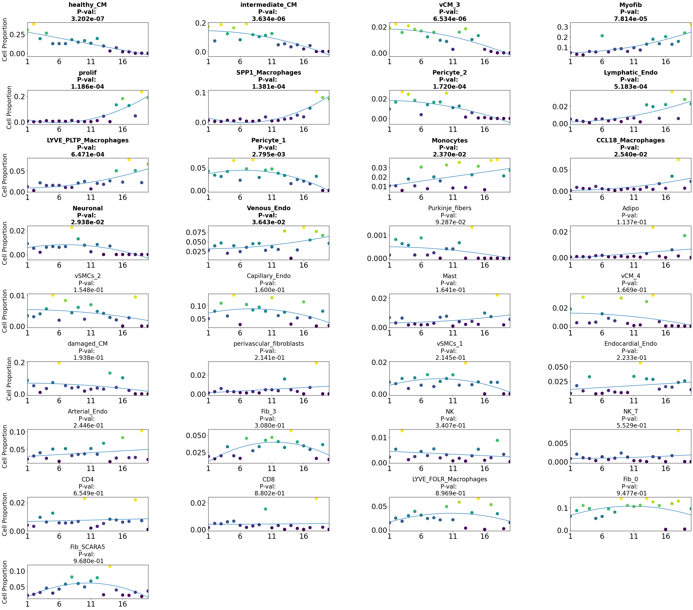

### Trajectory analysis of Myocardial Infarction using PILOT

<div class="alert alert-block alert-info">
<b>PILOT</b>

Welcome to the PILOT Package Tutorial for scRNA Data!

Here we show the whole process for applying PILOT to scRNA data using Myocardial Infarction scRNA Data, you can download the Anndata (h5ad) file from [here](https://costalab.ukaachen.de/open_data/PILOT/myocardial_infarction.h5ad).

</div>


```python
import PILOT as pl
import scanpy as sc
```

##### Reading Anndata


```python
adata=sc.read_h5ad('Datasets/myocardial_infarction.h5ad')
```

#### Loading the required information and computing the Wasserstein distance:
<div class="alert alert-block alert-info"> In order to work with PILOT, ensure that your Anndata object is loaded and contains the required information.
    
Use the following parameters to configure PILOT for your analysis (Setting Parameters):
    
adata: Pass your loaded Anndata object to PILOT.
    
emb_matrix: Provide the name of the variable in the obsm level that holds the dimension reduction (PCA representation).
    
clusters_col: Specify the name of the column in the observation level of your Anndata that corresponds to cell types or clusters.
    
sample_col: Indicate the column name in the observation level of your Anndata that contains information about samples or patients.
    
status: Provide the column name that represents the status or disease (e.g., "control" or "case").
       
</div>


```python
pl.tl.wasserstein_distance(adata,emb_matrix='PCA',
clusters_col='cell_subtype',sample_col='sampleID',status='Status')
```

#### Ploting the Cost matrix and the Wasserstein distance:
<div class="alert alert-block alert-info"> 
 Here we show the heatmaps of Cost matrix (cells) and Wasserstein distance (samples).      
</div>


```python
pl.pl.heatmaps(adata)
```


    

    


    

    


#### Trajectory:
<div class="alert alert-block alert-info"> 
 Here we show the Diffusion map of Wasserstein distance.
</div>


```python
pl.pl.trajectory(adata,colors=['Blue','red'])
```


    

    


####  Fit a principal graph:
<div class="alert alert-block alert-info"> 
Utilizing the EIPLGraph, we sketch the foundational structure of the trajectory. The source_node bears significance as it dictates where the sample ranking begins. If you have a clear starting point in mind, such as control samples, you can designate it as the source node. This method enables us to rank samples using a disease progression score (t = t1, ..., tn), where tl represents the ranking of the nth sample
</div>


```python
pl.pl.fit_pricipla_graph(adata,source_node=7)
```


    

    


####  Cell-type importance:
<div class="alert alert-block alert-info"> 
Here we get the critical cells that are changing over the disease progression(sorted samples based on the trajectory of PILOT with EIPLGraph).
</div>


```python
pl.tl.cell_importance(adata)
```


    

    


    

    


### Applyin PILOT for finding Markers

#### Gene selection:
<div class="alert alert-block alert-info"> 
In this step, we find marker genes that are changed specifically over the disease progression (order of Trajectory from Control to IZ) per specific cell. In other words, we uncover genes with different patterns.You need to reproduce whole markers for cells by running the following code. After running the code, you can  see a folder named 'Markers' that for each cell there is a folder inside that includes 'Whole_expressions.csv'. 
Whole_expressions file covers the found genes and their statistics.    
Please be patient for this part, it takes time for whole cells. Here we find the genes for 'Healthy_CM' cell type as an example. You should run it for the whole group of your cell types to find the markers for the next step.
    
* You need to set names of columns that show cell_types/clusters and Samples/Patinets in your object.
</div>


```python
pl.tl.genes_importance(adata,name_cell=adata.uns['cellnames'][1],sample_col='sampleID',col_cell='cell_subtype')
```

    Name of Cell type : healthy_CM
    sparsity:0.6932279564364608
    For this cell_type, p-value of  3206 genes are statistically significant.
               Expression pattern  count
    4    linear up quadratic down   1134
    2    linear down quadratic up    758
    0                 linear down    581
    3                   linear up    347
    6              quadratic down    216
    7                quadratic up    164
    1  linear down quadratic down      5
    5      linear up quadratic up      1
    data saved successfully


    

    


#### Gene Cluster Differentiation:
<div class="alert alert-block alert-info"> 
In this stage, we deploy the Gene_Cluster_Differentiation function to unveil gene patterns unique to each cell type compared to others. Before diving in, complete the preceding steps for all cell types.

The code snippet below emphasizes 'healthy CM' and 'Myofib' cells, spotlighting their distinct marker gene patterns. You can customize this for your focus or explore all cells.

The "number_genes" parameter governs the gene count per pattern (linear, quadratic, etc.).

PILOT then extracts genes from selected cell types and documents patterns in 'gene_clusters_stats_extend.' This file showcases markers of your selected cells like 'healthy CM' and 'Myofib' across diverse cell types, with statistics. 
    
Check the "plots_gene_cluster_differentiation" folder for an array of plots that highlight the pattern of selected markers in specific cells (shown as orange lines) compared to other cell types (represented by grey lines). 
</div>


```python
pl.tl.gene_cluster_differentiation(cellnames=['healthy_CM','Myofib'],number_genes=70)
```

    


#### Exploring the results for a specific cell type :
<div class="alert alert-block alert-info"> 
If you have specific genes of interest or prefer to select certain genes according to your preferences, you can proceed with this phase.
    
    
After completing the previous steps, you can review the 'gene_clusters_stats_extend' file. To assist you in exploring the results, we offer a function called 'results_gene_cluster_differentiation'. This function enables you to sort the results according to your preferences. For instance, if you're interested in obtaining genes related to 'Myofib', you can use the function to sort the results based on attributes like Fold Change and p-values. This allows you to gain insights into the most relevant genes for your specific analysis. 
    

</div>


```python
pl.tl.results_gene_cluster_differentiation(cluster_name='Myofib').head(15)
```


<div>
<style scoped>
    .dataframe tbody tr th:only-of-type {
        vertical-align: middle;
    }

    .dataframe tbody tr th {
        vertical-align: top;
    }

    .dataframe thead th {
        text-align: right;
    }
</style>
<table border="1" class="dataframe">
  <thead>
    <tr style="text-align: right;">
      <th></th>
      <th>gene</th>
      <th>cluster</th>
      <th>waldStat</th>
      <th>df</th>
      <th>pvalue</th>
      <th>FC</th>
      <th>Expression pattern</th>
      <th>fit-pvalue</th>
      <th>fit-rsquared</th>
      <th>fit-mod-rsquared</th>
    </tr>
  </thead>
  <tbody>
    <tr>
      <th>2832</th>
      <td>GXYLT2</td>
      <td>Myofib</td>
      <td>16.558622</td>
      <td>3</td>
      <td>8.709144e-04</td>
      <td>2.000205</td>
      <td>linear up quadratic down</td>
      <td>2.402171e-85</td>
      <td>0.034837</td>
      <td>0.537920</td>
    </tr>
    <tr>
      <th>2529</th>
      <td>FN1</td>
      <td>Myofib</td>
      <td>13.290116</td>
      <td>3</td>
      <td>4.049427e-03</td>
      <td>1.573680</td>
      <td>linear down quadratic up</td>
      <td>2.947389e-188</td>
      <td>0.099780</td>
      <td>0.633774</td>
    </tr>
    <tr>
      <th>1372</th>
      <td>COL1A2</td>
      <td>Myofib</td>
      <td>17.891454</td>
      <td>3</td>
      <td>4.631138e-04</td>
      <td>1.327753</td>
      <td>linear down quadratic up</td>
      <td>0.000000e+00</td>
      <td>0.231484</td>
      <td>0.655032</td>
    </tr>
    <tr>
      <th>1392</th>
      <td>COL3A1</td>
      <td>Myofib</td>
      <td>14.131029</td>
      <td>3</td>
      <td>2.732118e-03</td>
      <td>1.240454</td>
      <td>linear down quadratic up</td>
      <td>0.000000e+00</td>
      <td>0.275497</td>
      <td>0.665616</td>
    </tr>
    <tr>
      <th>2642</th>
      <td>GAS7</td>
      <td>Myofib</td>
      <td>1120.683802</td>
      <td>3</td>
      <td>1.184877e-242</td>
      <td>1.086644</td>
      <td>linear up quadratic down</td>
      <td>1.873033e-107</td>
      <td>0.082635</td>
      <td>0.570704</td>
    </tr>
    <tr>
      <th>6053</th>
      <td>SLC20A1</td>
      <td>Myofib</td>
      <td>2.975838</td>
      <td>3</td>
      <td>3.953656e-01</td>
      <td>1.083983</td>
      <td>linear down quadratic up</td>
      <td>5.900150e-79</td>
      <td>0.022840</td>
      <td>0.549634</td>
    </tr>
    <tr>
      <th>1437</th>
      <td>COL6A3</td>
      <td>Myofib</td>
      <td>95.945158</td>
      <td>3</td>
      <td>1.156600e-20</td>
      <td>1.069156</td>
      <td>linear down quadratic up</td>
      <td>3.514298e-172</td>
      <td>0.085799</td>
      <td>0.608543</td>
    </tr>
    <tr>
      <th>1710</th>
      <td>DCN</td>
      <td>Myofib</td>
      <td>27.320866</td>
      <td>3</td>
      <td>5.042427e-06</td>
      <td>1.033697</td>
      <td>linear up quadratic down</td>
      <td>1.866152e-284</td>
      <td>0.118391</td>
      <td>0.588602</td>
    </tr>
    <tr>
      <th>5775</th>
      <td>RORA</td>
      <td>Myofib</td>
      <td>1461.764959</td>
      <td>3</td>
      <td>0.000000e+00</td>
      <td>0.899459</td>
      <td>quadratic down</td>
      <td>7.232834e-174</td>
      <td>0.029289</td>
      <td>0.587234</td>
    </tr>
    <tr>
      <th>3783</th>
      <td>MGP</td>
      <td>Myofib</td>
      <td>3.358545</td>
      <td>3</td>
      <td>3.395770e-01</td>
      <td>0.871041</td>
      <td>quadratic down</td>
      <td>1.327779e-225</td>
      <td>0.093052</td>
      <td>0.571374</td>
    </tr>
    <tr>
      <th>4979</th>
      <td>PKNOX2</td>
      <td>Myofib</td>
      <td>11.032610</td>
      <td>3</td>
      <td>1.155084e-02</td>
      <td>0.855504</td>
      <td>quadratic down</td>
      <td>1.039404e-117</td>
      <td>0.040874</td>
      <td>0.544122</td>
    </tr>
    <tr>
      <th>7245</th>
      <td>VCAN</td>
      <td>Myofib</td>
      <td>4.083920</td>
      <td>3</td>
      <td>2.525437e-01</td>
      <td>0.838764</td>
      <td>linear down quadratic up</td>
      <td>1.761922e-164</td>
      <td>0.066772</td>
      <td>0.571981</td>
    </tr>
    <tr>
      <th>5929</th>
      <td>SEC24D</td>
      <td>Myofib</td>
      <td>22.793274</td>
      <td>3</td>
      <td>4.459441e-05</td>
      <td>0.806642</td>
      <td>linear down quadratic up</td>
      <td>6.604860e-64</td>
      <td>0.024282</td>
      <td>0.522700</td>
    </tr>
    <tr>
      <th>2151</th>
      <td>EXT1</td>
      <td>Myofib</td>
      <td>146.307312</td>
      <td>3</td>
      <td>1.649235e-31</td>
      <td>0.786136</td>
      <td>linear up quadratic down</td>
      <td>3.159831e-35</td>
      <td>0.016228</td>
      <td>0.555757</td>
    </tr>
    <tr>
      <th>1359</th>
      <td>COL1A1</td>
      <td>Myofib</td>
      <td>0.061405</td>
      <td>3</td>
      <td>9.960268e-01</td>
      <td>0.726953</td>
      <td>linear down quadratic up</td>
      <td>0.000000e+00</td>
      <td>0.311453</td>
      <td>0.680489</td>
    </tr>
  </tbody>
</table>
</div>


#####  Myofib cells

<div class="alert alert-block alert-info"> 
In this step, we have chosen specific genes mentioned in the paper ('DCN','EXT1','COL1A2') to observe their expression patterns in the context of Myofib in comparison to other cell types. You can look at the plots (for these genes) in the "plots_gene_cluster_differentiation" folder. 
    
    
* Please note that the upcoming step will update the associated "plots_gene_cluster_differentiation" folder. It's recommended to keep a backup of these files if you want them.
 </div>


```python
pl.tl.exploring_specific_genes(cluster_name='Myofib',gene_list=['DCN','EXT1','COL1A2'])
```


    <Figure size 640x480 with 0 Axes>


    

    


    <Figure size 640x480 with 0 Axes>


    

    


    <Figure size 640x480 with 0 Axes>


    

    


    <Figure size 640x480 with 0 Axes>


    

    


    <Figure size 640x480 with 0 Axes>


    

    


    <Figure size 640x480 with 0 Axes>


    

    


    <Figure size 640x480 with 0 Axes>


    

    


    <Figure size 640x480 with 0 Axes>


    

    


    <Figure size 640x480 with 0 Axes>


    

    


    <Figure size 640x480 with 0 Axes>


    

    


```python

```
