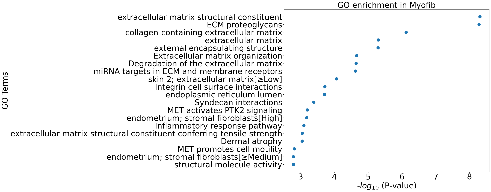
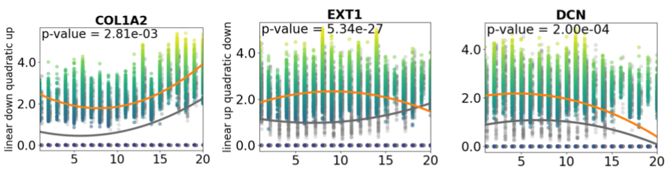
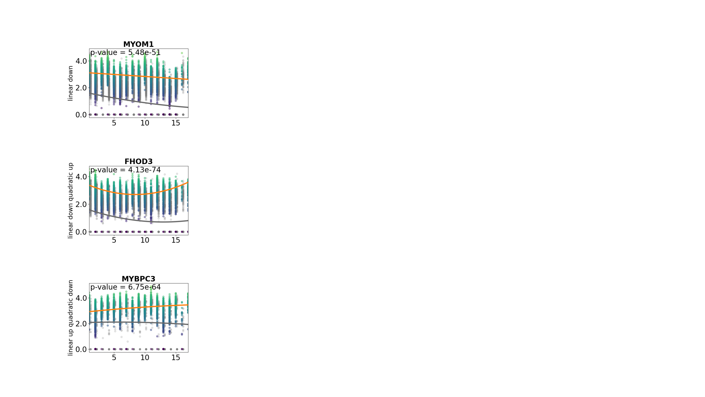

### Trajectory analysis of Myocardial Infarction using PILOT

<div class="alert alert-block alert-info">
<b>PILOT</b>

Welcome to the PILOT Package Tutorial for scRNA Data!

Here we show the whole process for applying PILOT to scRNA data using Myocardial Infarction scRNA Data, you can download the Anndata (h5ad) file from [here](https://costalab.ukaachen.de/open_data/PILOT/myocardial_infarction.h5ad).

</div>


```python
import PILOT as pl
import scanpy as sc
```

##### Reading Anndata


```python
adata=sc.read_h5ad('myocardial_infarction.h5ad')
```

###### Loading the required information and computing the Wasserstein distance:
<div class="alert alert-block alert-info"> In order to work with PILOT, ensure that your Anndata object is loaded and contains the required information.
    
Use the following parameters to configure PILOT for your analysis (Setting Parameters):
    
adata: Pass your loaded Anndata object to PILOT.
    
emb_matrix: Provide the name of the variable in the obsm level that holds the dimension reduction (PCA representation).
    
clusters_col: Specify the name of the column in the observation level of your Anndata that corresponds to cell types or clusters.
    
sample_col: Indicate the column name in the observation level of your Anndata that contains information about samples or patients.
    
status: Provide the column name that represents the status or disease (e.g., "control" or "case").
       
</div>


```python
pl.tl.wasserstein_distance(adata,emb_matrix='PCA',
clusters_col='cell_subtype',sample_col='sampleID',status='Status')
```

##### Ploting the Cost matrix and the Wasserstein distance:
<div class="alert alert-block alert-info"> 
 Here we show the heatmaps of Cost matrix (cells) and Wasserstein distance (samples).      
</div>


```python
pl.pl.heatmaps(adata)
```


    

    


    

    


##### Trajectory:
<div class="alert alert-block alert-info"> 
 Here we show the Diffusion map of Wasserstein distance.
</div>


```python
pl.pl.trajectory(adata,colors=['Blue','red'])
```


    

    


#####  Fit a principal graph:
<div class="alert alert-block alert-info"> 
The difussion map creates an embedding that potentially reveals a trajectory in the data. Next, PILOT explores EIPLGraph to find the structure of the trajectory. An important parameter is the source_node, which indicates the start of the trajectory. Here, we selected a control sample (node by id 7). This method returns rank samples, which we define as a disease progression score (t = t1, ..., tn), where tl represents the ranking of the nth sample.
</div>


```python
pl.pl.fit_pricipla_graph(adata,source_node=7)
```


    

    


#####  Cell-type importance:
<div class="alert alert-block alert-info"> 
Next, we can use the robust regression model to find cells whose proportions change linearly or non-linearly with disease progression. As indicated in the paper, major hallmark of MI progression are detected, i.e., a decrease of cardiomyocyte cells (CM) and an increase of fibroblasts and myeloid cells.
</div>


```python
pl.tl.cell_importance(adata,height=45,width=38,fontsize=28)
```


    

    


    

    


##### Applying PILOT for finding Markers

##### Gene selection:
<div class="alert alert-block alert-info"> 
Given that we found interesting cell types, we would like to investigate genes associated with these trajectories, i.e. genes, whose expression changes linearly or quadratically with the disease progression. After running the command, you can find a folder named ‘Markers’. There, we will have a folder for each cell type. The file ‘Whole_expressions.csv’ contains all statistics associated with genes for that cell type. Here, we run the genes_importance function for whole cell types.
    
* You need to set names of columns that show cell_types/clusters and Samples/Patients in your object.
</div>


```python
for cell in adata.uns['cellnames']:
    pl.tl.genes_importance(adata,name_cell=cell,sample_col='sampleID',col_cell='cell_subtype',plot_genes=False)
```

    


##### Cluster Specific Marker Changes:
<div class="alert alert-block alert-info"> 
The previous test only finds genes with significant changes over time for a given cell type. However, it does not consider if a similar pattern and expression values are found in other clusters. To further select genes, we use a Wald test that compares the fit of the gene in the cluster vs. the fit of the gene in other clusters.
In the code below, we consider top genes (regarding the regression fit) for two interesting cell types discussed in the manuscript (‘healthy CM’ and ‘Myofib’).
</div>


```python
pl.tl.gene_cluster_differentiation(adata,cellnames=['healthy_CM','Myofib'],number_genes=70)
```

    


<div class="alert alert-block alert-info"> 
Test results are saved in ‘gene_clusters_stats_extend.csv’. To find a final list of genes, we only consider genes with a fold change higher than 0.5, i.e. genes which expression is increased in the cluster at hand; and we sort the genes based on the Wald test p-value. These can be seen bellow.
</div>


```python
df=pl.tl.results_gene_cluster_differentiation(cluster_name='Myofib').head(50)
df.head(15)
```


<div>
<style scoped>
    .dataframe tbody tr th:only-of-type {
        vertical-align: middle;
    }

    .dataframe tbody tr th {
        vertical-align: top;
    }

    .dataframe thead th {
        text-align: right;
    }
</style>
<table border="1" class="dataframe">
  <thead>
    <tr style="text-align: right;">
      <th></th>
      <th>gene</th>
      <th>cluster</th>
      <th>waldStat</th>
      <th>pvalue</th>
      <th>FC</th>
      <th>Expression pattern</th>
      <th>fit-pvalue</th>
      <th>fit-mod-rsquared</th>
    </tr>
  </thead>
  <tbody>
    <tr>
      <th>2642</th>
      <td>GAS7</td>
      <td>Myofib</td>
      <td>212.477292</td>
      <td>8.487275e-46</td>
      <td>1.086644</td>
      <td>linear up quadratic down</td>
      <td>1.873033e-107</td>
      <td>0.570704</td>
    </tr>
    <tr>
      <th>2151</th>
      <td>EXT1</td>
      <td>Myofib</td>
      <td>125.383128</td>
      <td>5.344198e-27</td>
      <td>0.786136</td>
      <td>linear up quadratic down</td>
      <td>3.159831e-35</td>
      <td>0.555757</td>
    </tr>
    <tr>
      <th>4979</th>
      <td>PKNOX2</td>
      <td>Myofib</td>
      <td>89.738712</td>
      <td>2.492742e-19</td>
      <td>0.855504</td>
      <td>quadratic down</td>
      <td>1.039404e-117</td>
      <td>0.544122</td>
    </tr>
    <tr>
      <th>2529</th>
      <td>FN1</td>
      <td>Myofib</td>
      <td>70.641696</td>
      <td>3.110595e-15</td>
      <td>1.573680</td>
      <td>linear down quadratic up</td>
      <td>2.947389e-188</td>
      <td>0.633774</td>
    </tr>
    <tr>
      <th>1437</th>
      <td>COL6A3</td>
      <td>Myofib</td>
      <td>54.751169</td>
      <td>7.758841e-12</td>
      <td>1.069156</td>
      <td>linear down quadratic up</td>
      <td>3.514298e-172</td>
      <td>0.608543</td>
    </tr>
    <tr>
      <th>5775</th>
      <td>RORA</td>
      <td>Myofib</td>
      <td>52.486295</td>
      <td>2.359167e-11</td>
      <td>0.899459</td>
      <td>quadratic down</td>
      <td>7.232834e-174</td>
      <td>0.587234</td>
    </tr>
    <tr>
      <th>2832</th>
      <td>GXYLT2</td>
      <td>Myofib</td>
      <td>24.247113</td>
      <td>2.218154e-05</td>
      <td>2.000205</td>
      <td>linear up quadratic down</td>
      <td>2.402171e-85</td>
      <td>0.537920</td>
    </tr>
    <tr>
      <th>3783</th>
      <td>MGP</td>
      <td>Myofib</td>
      <td>23.244418</td>
      <td>3.591226e-05</td>
      <td>0.871041</td>
      <td>quadratic down</td>
      <td>1.327779e-225</td>
      <td>0.571374</td>
    </tr>
    <tr>
      <th>4726</th>
      <td>PCDH9</td>
      <td>Myofib</td>
      <td>20.439646</td>
      <td>1.376052e-04</td>
      <td>0.604830</td>
      <td>linear down</td>
      <td>0.000000e+00</td>
      <td>0.596035</td>
    </tr>
    <tr>
      <th>1231</th>
      <td>CHD9</td>
      <td>Myofib</td>
      <td>20.389564</td>
      <td>1.409364e-04</td>
      <td>0.527488</td>
      <td>linear up quadratic down</td>
      <td>7.658862e-77</td>
      <td>0.559604</td>
    </tr>
    <tr>
      <th>1710</th>
      <td>DCN</td>
      <td>Myofib</td>
      <td>19.656307</td>
      <td>1.999818e-04</td>
      <td>1.033697</td>
      <td>linear up quadratic down</td>
      <td>1.866152e-284</td>
      <td>0.588602</td>
    </tr>
    <tr>
      <th>2824</th>
      <td>GSN</td>
      <td>Myofib</td>
      <td>18.015612</td>
      <td>4.366007e-04</td>
      <td>0.638136</td>
      <td>linear up quadratic down</td>
      <td>2.942472e-279</td>
      <td>0.601684</td>
    </tr>
    <tr>
      <th>1392</th>
      <td>COL3A1</td>
      <td>Myofib</td>
      <td>17.276479</td>
      <td>6.199787e-04</td>
      <td>1.240454</td>
      <td>linear down quadratic up</td>
      <td>0.000000e+00</td>
      <td>0.665616</td>
    </tr>
    <tr>
      <th>1372</th>
      <td>COL1A2</td>
      <td>Myofib</td>
      <td>14.068816</td>
      <td>2.812963e-03</td>
      <td>1.327753</td>
      <td>linear down quadratic up</td>
      <td>0.000000e+00</td>
      <td>0.655032</td>
    </tr>
    <tr>
      <th>7245</th>
      <td>VCAN</td>
      <td>Myofib</td>
      <td>12.610158</td>
      <td>5.560192e-03</td>
      <td>0.838764</td>
      <td>linear down quadratic up</td>
      <td>1.761922e-164</td>
      <td>0.571981</td>
    </tr>
  </tbody>
</table>
</div>


<div class="alert alert-block alert-info"> 
Here is the GO enrichment for  the 50 first top genes of Myofib (FC >= 0.5 and p-value < 0.01).
</div>


```python
pl.pl.go_enrichment(df,cell_type='Myofib')
```


    

    


<div class="alert alert-block alert-info"> 
Plots of genes are saved at 'plot_genes_for_Myofib' folder. We can visualize specific genes, for example the ones discussed in PILOT manuscript (COL1A2, DCN and EXT1). In the plot, the orange line indicates the fit in the target cell type (shown as orange lines) compared to other cell types (represented by grey lines).
</div>


```python
pl.pl.exploring_specific_genes(cluster_name='Myofib',gene_list=['COL1A2','DCN','EXT1'],)
```


    

    


<div class="alert alert-block alert-info"> 
We can repeat the same analysis for healthy_CM cell type by using the following commands.
</div>


```python
df=pl.tl.results_gene_cluster_differentiation(cluster_name='healthy_CM').head(50)
df.head(15)
```


<div>
<style scoped>
    .dataframe tbody tr th:only-of-type {
        vertical-align: middle;
    }

    .dataframe tbody tr th {
        vertical-align: top;
    }

    .dataframe thead th {
        text-align: right;
    }
</style>
<table border="1" class="dataframe">
  <thead>
    <tr style="text-align: right;">
      <th></th>
      <th>gene</th>
      <th>cluster</th>
      <th>waldStat</th>
      <th>pvalue</th>
      <th>FC</th>
      <th>Expression pattern</th>
      <th>fit-pvalue</th>
      <th>fit-mod-rsquared</th>
    </tr>
  </thead>
  <tbody>
    <tr>
      <th>6165</th>
      <td>SORBS1</td>
      <td>healthy_CM</td>
      <td>1574.665604</td>
      <td>0.000000e+00</td>
      <td>1.296470</td>
      <td>linear down quadratic up</td>
      <td>8.946560e-05</td>
      <td>0.522953</td>
    </tr>
    <tr>
      <th>1772</th>
      <td>DLG2</td>
      <td>healthy_CM</td>
      <td>1055.313030</td>
      <td>1.801893e-228</td>
      <td>1.155496</td>
      <td>linear down quadratic up</td>
      <td>1.323610e-256</td>
      <td>0.556306</td>
    </tr>
    <tr>
      <th>6733</th>
      <td>THSD4</td>
      <td>healthy_CM</td>
      <td>834.288239</td>
      <td>1.583902e-180</td>
      <td>1.671315</td>
      <td>linear down quadratic up</td>
      <td>6.088694e-250</td>
      <td>0.582085</td>
    </tr>
    <tr>
      <th>1276</th>
      <td>CMYA5</td>
      <td>healthy_CM</td>
      <td>752.301407</td>
      <td>9.561746e-163</td>
      <td>1.559703</td>
      <td>linear down quadratic up</td>
      <td>3.774063e-66</td>
      <td>0.527869</td>
    </tr>
    <tr>
      <th>3281</th>
      <td>LDB3</td>
      <td>healthy_CM</td>
      <td>542.239458</td>
      <td>3.342198e-117</td>
      <td>1.426196</td>
      <td>linear down quadratic up</td>
      <td>1.511694e-238</td>
      <td>0.546327</td>
    </tr>
    <tr>
      <th>36</th>
      <td>ABLIM1</td>
      <td>healthy_CM</td>
      <td>379.423867</td>
      <td>6.335728e-82</td>
      <td>0.979378</td>
      <td>linear up</td>
      <td>3.296026e-13</td>
      <td>0.513734</td>
    </tr>
    <tr>
      <th>6903</th>
      <td>TNNT2</td>
      <td>healthy_CM</td>
      <td>373.037957</td>
      <td>1.530428e-80</td>
      <td>1.392561</td>
      <td>linear down quadratic up</td>
      <td>2.329698e-118</td>
      <td>0.535236</td>
    </tr>
    <tr>
      <th>2398</th>
      <td>FHOD3</td>
      <td>healthy_CM</td>
      <td>343.341326</td>
      <td>4.125161e-74</td>
      <td>1.731741</td>
      <td>linear down quadratic up</td>
      <td>0.000000e+00</td>
      <td>0.612758</td>
    </tr>
    <tr>
      <th>6663</th>
      <td>TECRL</td>
      <td>healthy_CM</td>
      <td>338.848075</td>
      <td>3.875199e-73</td>
      <td>1.261289</td>
      <td>linear up quadratic down</td>
      <td>0.000000e+00</td>
      <td>0.570571</td>
    </tr>
    <tr>
      <th>4056</th>
      <td>MYBPC3</td>
      <td>healthy_CM</td>
      <td>296.157297</td>
      <td>6.751814e-64</td>
      <td>0.686940</td>
      <td>linear up quadratic down</td>
      <td>0.000000e+00</td>
      <td>0.557570</td>
    </tr>
    <tr>
      <th>5652</th>
      <td>RCAN2</td>
      <td>healthy_CM</td>
      <td>287.996090</td>
      <td>3.940736e-62</td>
      <td>1.214055</td>
      <td>linear down quadratic up</td>
      <td>0.000000e+00</td>
      <td>0.566313</td>
    </tr>
    <tr>
      <th>1830</th>
      <td>DOCK3</td>
      <td>healthy_CM</td>
      <td>269.653643</td>
      <td>3.667754e-58</td>
      <td>0.534836</td>
      <td>linear down quadratic up</td>
      <td>2.678914e-202</td>
      <td>0.527979</td>
    </tr>
    <tr>
      <th>4177</th>
      <td>MYOM1</td>
      <td>healthy_CM</td>
      <td>236.482875</td>
      <td>5.483541e-51</td>
      <td>1.637375</td>
      <td>linear down</td>
      <td>1.381677e-268</td>
      <td>0.548281</td>
    </tr>
    <tr>
      <th>1915</th>
      <td>EFNA5</td>
      <td>healthy_CM</td>
      <td>236.263957</td>
      <td>6.115035e-51</td>
      <td>1.089847</td>
      <td>linear down</td>
      <td>1.127515e-164</td>
      <td>0.532078</td>
    </tr>
    <tr>
      <th>5436</th>
      <td>PXDNL</td>
      <td>healthy_CM</td>
      <td>227.066418</td>
      <td>5.957588e-49</td>
      <td>1.284827</td>
      <td>linear down quadratic up</td>
      <td>1.815885e-03</td>
      <td>0.518712</td>
    </tr>
  </tbody>
</table>
</div>


```python
pl.pl.go_enrichment(df,cell_type='healthy_CM')
```


    

    


```python
pl.pl.exploring_specific_genes(cluster_name='healthy_CM',gene_list=['MYBPC3','MYOM1','FHOD3'])
```


    

    


```python

```
